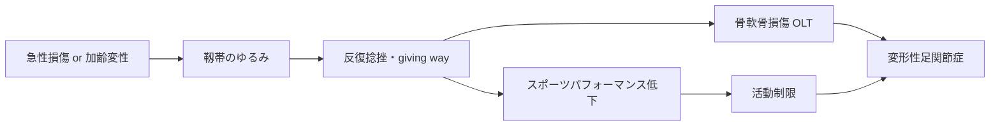

# 足関節不安定症：病態・診断

> 本ページは **病態** と **診断** を統合しています。外側側副靱帯の急性損傷（捻挫）から慢性不安定症（CAI）までを一連の連続病態として扱います。

## 1. 病態スペクトラム

外側側副靱帯損傷 → 慢性足関節不安定症（CAI）は **同一スペクトラムの連続病態** であり、二大病因が存在する。

| 病因 | 特徴 | 典型例 |
|------|------|--------|
| **(a) 急性外傷型** | スポーツ・段差で急激な内反強制 → 靱帯断裂 | 若年アスリート、初回捻挫 |
| **(b) 加齢変性型** | 反復微細損傷・コラーゲン変性で靱帯がゆるむ | 中高年、明らかな受傷歴なしに「最近よくぐらつく」 |

どちらの病因でも、適切に治療されなければ:

→ 最終的に **変形性足関節症** に至るため、早期介入が重要。

## 2. 外側支持機構の解剖

| 靱帯 | 走行 | 役割 |
|------|------|------|
| **前距腓靱帯（ATFL）** | 腓骨遠位前縁 → 距骨外側 | 底屈位での内反制動。最も損傷頻度が高い |
| **踵腓靱帯（CFL）** | 腓骨遠位先端 → 踵骨外側 | 中間位での内反制動。距骨下関節も安定化 |
| **後距腓靱帯（PTFL）** | 腓骨遠位後方 → 距骨後突起 | 背屈位での内反制動。単独損傷はまれ |

## 3. 病態分類（Hertel）

- **機械的不安定性（Mechanical Instability）** — 距骨傾斜・前方引き出しの過度
- **機能的不安定性（Functional Instability）** — 固有感覚・神経筋制御の障害（"giving way"）
- 両者は連続体として併存する

## 4. 急性期：重症度分類

| Grade | 病態 | 所見 |
|-------|------|------|
| I | 微細損傷 | 軽度腫脹、荷重可能 |
| II | 部分断裂 | 中等度腫脹・皮下出血、荷重困難 |
| III | 完全断裂 | 著明腫脹、関節不安定、荷重不能 |

## 5. 慢性期の特徴：**症状が微細**

!!! warning "見逃されやすい慢性期症状"
    急性捻挫の派手な腫脹・痛みと違い、慢性足関節不安定症の症状は **きわめて微細** で本人も病院も見逃しやすい。

    - 漠然とした足首の不安感
    - 平らな地面でも「ぐらっ」とすることがある
    - 長く歩いた後の鈍痛
    - 軽く何度も捻る（がはっきりした受傷感はない）
    - スポーツでの瞬発動作・カット動作が以前より苦手

    患者本人は「老化かな」「以前から少しある」と訴えず、整形外科を受診するきっかけを失いやすい。
    既往の捻挫歴があり、上記症状を持つ患者には **積極的にスクリーニング** すべき。

## 6. 疫学

- 急性足関節捻挫の年間発生率: 一般人口で **2.15/1,000 人年**
- 急性捻挫の **約 85%** が外側側副靱帯（ATFL ± CFL）損傷
- 捻挫後の **30–40%** が慢性化症状を残す
- スポーツ復帰後の **再受傷率: 約 30%**

---

## 7. 診断

### 7-1. 病歴聴取

| 項目 | 内容 |
|------|------|
| 受傷歴 | 初回受傷機転、回数、最後の受傷時期 |
| 急性期は | 受傷時の音（pop）、直後の荷重可否 |
| 慢性期は | giving way の頻度、不安感、スポーツ・歩行制限 |
| スコア | **CAIT ≤ 24点** で診断的、FAAM, FAOS, AOFAS Hindfoot |
| 加齢型は | 受傷歴なくとも進行する。「以前より歩きにくい」「軽い段差で躓く」 |

### 7-2. 身体所見

=== "前方引き出しテスト"
    底屈 10–20°、脛骨を後方へ押し付け踵を前方へ引く。
    **健側比 +3 mm 以上、または絶対値 10 mm 以上** で陽性。

=== "内反ストレステスト（Talar Tilt）"
    踵骨を内反させ距骨傾斜角を評価。
    **健側比 5° 以上の差**、または **絶対 10° 以上** で陽性。

=== "Squeeze test / External rotation test"
    高位足関節捻挫（syndesmosis injury）の鑑別。

その他重要所見:

- 圧痛部位（ATFL、CFL、第5中足骨基部、腓骨筋腱、内側）
- 急性期の機能テストは制限あり → **受傷後 4–5 日に再評価** が推奨
- 後足部アライメント（内反、凹足）
- 腓骨筋腱の弾発音・脱臼
- 関節弛緩テスト（Beighton スコア）

### 7-3. Ottawa Ankle Rules（急性期 X 線撮像の適応）

以下のいずれかで X 線撮像を考慮:

- 外果後縁または先端の圧痛
- 内果後縁または先端の圧痛
- 第5中足骨基部の圧痛
- 舟状骨の圧痛
- 受傷直後または救急で **4歩以上歩行不能**

### 7-4. 画像検査

| 検査 | 目的 |
|------|------|
| 単純X線（正面・側面・モーティス・荷重位） | 骨折除外、変形・OA評価 |
| **ストレスX線**（前方引き出し・内反） | 機械的不安定性の客観化 |
| MRI | 靱帯損傷の質的評価、骨軟骨損傷（OLT）・腓骨筋腱症・距骨下関節病変の検索 |
| 超音波（動的評価） | 外来での即時評価、術後経過追跡 |
| CT（荷重位 / Weight-bearing CT） | 軟部組織以外の3次元評価、後足部アライメント評価 |

### 7-5. 鑑別・合併損傷（"Three-bucket" rule）

CAI患者の **約60–80% に合併病変** あり。手術前に必ずスクリーニング:

1. **関節内** — 骨軟骨損傷（OLT）、滑膜炎、遊離体、前外側インピンジメント
2. **関節外（内側）** — 距腿後方インピンジメント、後脛骨筋腱症
3. **関節外（外側）** — 腓骨筋腱断裂・脱臼、腓骨筋下支帯損傷
4. **アライメント** — 後足部内反、凹足、第1中足骨底屈

### 7-6. その他の鑑別

- 第5中足骨基部骨折（Jones / avulsion）
- 距骨骨軟骨損傷の単独病変
- **高位足関節捻挫**（syndesmosis injury）
- 内側靱帯損傷（deltoid）

## 関連

- 次: [保存治療 →](conservative.md)
