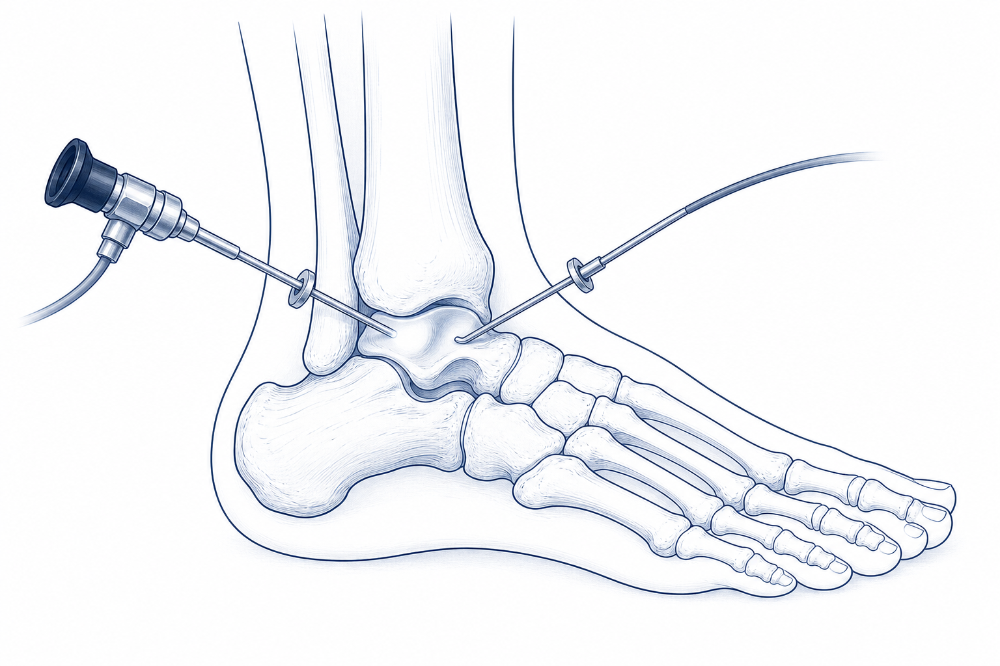

# 足関節不安定症：手術治療と後療法

!!! abstract "要点"
    - 当院標準術式は **関節鏡視下 Broström**（arthroscopic Broström）
    - 関節内合併病変（OLT、滑膜炎、骨棘）の同時処置が可能
    - 当院後療法プロトコル：
        - **翌日から歩行許可**
        - 抜糸 **10–14日**
        - **包帯またはサポーター 6週間**
        - 入浴は **防水カバーで濡らさない → 抜糸後フリー**
        - **6週間で職場・スポーツ復帰**

---

## 1. 手術適応

- 適切な保存療法（3–6か月）で症状改善が乏しい
- 反復する giving way による日常・スポーツ制限
- 合併病変（OLT等）が手術適応となる場合
- 加齢変性型で進行性・不可逆な不安定感

## 2. 術式選択フローチャート

```
保存療法失敗 or 加齢変性で進行
  └─ 良質な ATFL/CFL 残存組織あり？
        ├─ Yes → 解剖学的修復（関節鏡視下 Broström を当院第一選択）
        │        ・open（観血法）も選択肢
        │        ・suture anchor 補強
        └─ No  → 解剖学的再建（autograft: 半腱様筋・薄筋 / allograft）
                  ・反復手術後、肥満、全身関節弛緩、ハイデマンド症例
```

非解剖学的再建（Watson-Jones, Evans, Chrisman-Snook）は腓骨筋腱を犠牲にし、距骨下関節可動域を制限するため **第一選択としては推奨されない**。

---

## 3. 当院標準術式：関節鏡視下 Broström

<figure class="figure-schema" markdown>

<figcaption>前内側・前外側の2ポータルから関節鏡と器具を挿入。関節内合併病変の同時処置 + suture anchor による ATFL 修復が可能。</figcaption>
</figure>

### 3-1. なぜ関節鏡視下か

- **小皮切**（数 mm のポータルのみ）で整容に優れる
- **関節内合併病変の同時処置**（OLT デブリードマン、滑膜切除、骨棘切除、遊離体摘出）
- 早期機能回復が観血法と同等またはやや早い
- 早期歩行・早期復帰プロトコルと相性が良い

### 3-2. 手技ステップ

| ステップ | ポイント |
|---|---|
| 体位 | 仰臥位、患肢挙上、ターニケット使用、足関節を端に出し関節鏡操作可能に |
| ポータル | 前内側・前外側（標準的な前方ポータル） |
| 関節内診断 | 全周性に診察。OLT、滑膜炎、骨棘、遊離体をスクリーニング |
| 関節内処置 | 必要に応じ OLT デブリードマン、骨棘切除、滑膜切除 |
| ATFL 修復 | suture anchor を腓骨遠位に挿入し、ATFL・前方関節包を腓骨側に縫合（経皮 or 鏡視下） |
| CFL 修復 | 緩み著明なら同様に補強 |
| Gould 補強 | 経皮的に伸筋支帯を腓骨遠位骨膜へ重ね合わせ縫合 |
| 神経保護 | **浅腓骨神経・腓腹神経** を皮切設計で回避 |
| 閉創 | ポータルは steri-strip、神経ブロック追加 |
| 外固定 | **包帯またはサポーター**（中間位）。シーネ・ギプスは不要 |

### 3-3. 関節鏡視下 Broström の利点

- 皮切が小さい → 整容性、創部疼痛軽減
- 関節内処置同時施行可
- 早期歩行・早期復帰プロトコル可能
- 観血法と同等のアウトカム

### 3-4. 留意点

- **学習曲線あり**（鏡視下操作、suture anchor 設置）
- 浅腓骨神経・腓腹神経損傷（5–10%）に注意
- 透視時間・鏡視時間が長くなりやすい

---

## 4. 代替・補助術式

### 4-1. 観血的 Modified Broström-Gould

- 外果前縁の J 字皮切（4–6 cm）から ATFL・CFL を直接縫合
- 鏡視下と同等のアウトカム、関節内処置は別ポータルが必要
- 鏡視下術式の前提条件が整わない場合に選択

### 4-2. 解剖学的再建術

- グラフト: 半腱様筋（自家）、薄筋（自家）、足底筋、同種腱
- 腓骨・距骨・踵骨にトンネル作成 → 解剖学的に ATFL ± CFL を再建
- 適応: ATFL組織残存不良、反復術後、全身関節弛緩、肥満、高強度スポーツ復帰希望

### 4-3. 合併病変への併施手術

| 合併病変 | 対応 |
|----------|------|
| 骨軟骨損傷（OLT） | 関節鏡下マイクロフラクチャー、自家骨軟骨移植、BMS+生物製剤 |
| 後足部内反 | 踵骨外反骨切り術（Dwyer lateralizing calcaneal osteotomy） |
| 第1中足骨底屈 | dorsiflexion osteotomy of 1st metatarsal |
| 腓骨筋腱症・断裂 | デブリードマン、tubularization、腱移行 |
| 凹足（cavovarus） | アライメント補正術 |

---

## 5. 合併症

| 合併症 | 頻度 | 対策 |
|--------|------|------|
| 浅腓骨神経・腓腹神経損傷 | 5–10% | 皮切設計、皮下展開を慎重に |
| 創部感染（SSI） | 1–3% | 喫煙・糖尿病・低栄養のコントロール |
| 深部静脈血栓症（DVT） | <2% | 早期歩行（当院プロトコルで自然に予防）、リスク高ければ薬物予防 |
| 再不安定 | 5–15%（10年） | リハビリ完遂、再受傷予防教育 |
| 関節拘縮 | 5–10% | 早期可動域訓練 |
| Complex Regional Pain Syndrome（CRPS） | <2% | 早期発見、ペインクリニック介入 |

---

## 6. アウトカム

- **関節鏡視下 Broström** / Modified Broström-Gould 法: 良好以上 **85–95%**、患者満足度 **90%** 前後
- スポーツ復帰率: 80–90%、復帰時期 **中央値 6 週間**（当院プロトコル）
- 長期: 10年後の機械的不安定再発 約 10%、変形性関節症進行と相関

---

## 7. 当院後療法プロトコル

!!! abstract "後療法サマリー"
    - **翌日から歩行許可**（包帯・サポーター装着下）
    - 抜糸 **10–14 日**
    - **包帯またはサポーター 6 週間**
    - シャワー: 創部を **濡らさないようにすれば術後早期から OK**、**抜糸後はフリー**
    - **6 週間で職場・スポーツ復帰**

### 7-1. 周術期管理（術前・術中・術後）

#### 7-1-1. 術前確認

| 項目 | チェック |
|------|----------|
| 皮膚 | 外果周囲の発赤・水疱・湿疹・白癬・潰瘍 |
| 末梢循環 | 足背動脈・後脛骨動脈触知、足趾の色調・温度 |
| 神経学的所見 | 足趾運動、しびれ・感覚の左右差（術前記録） |
| 既往 | 糖尿病（HbA1c）、抗血栓薬、ステロイド |
| 内服 | 抗血栓薬の休薬指示、生物学的製剤の継続可否 |
| 生活 | **禁煙指導**、栄養状態 |

#### 7-1-2. 術後即時：観察項目

| 項目 | 頻度 | チェック内容 |
|------|------|--------------|
| バイタル | 4 時間毎 | 標準 |
| 末梢神経 | 2–4 時間毎 | 母趾背屈、第1-2趾間感覚（深腓骨神経）、足背感覚（浅腓骨神経）、足底感覚（脛骨神経） |
| 末梢循環 | 2–4 時間毎 | 足趾色調、温度、CRT、足背動脈 |
| 疼痛 | 各勤務 | NRS/VAS、鎮痛効果 |
| 包帯 | 各勤務 | ずれ、滲出、皮膚圧迫所見 |
| 患肢挙上 | 随時 | 心臓より高く |

!!! danger "緊急で医師報告すべき所見"
    - 足趾の強い痛み・しびれ・冷感・色調変化（コンパートメント症候群、循環障害）
    - 包帯内の急速増大する腫脹、圧迫感の訴え
    - 足趾運動消失（特に母趾背屈不能 → 腓骨神経麻痺）
    - 安静時 NRS ≥ 7、鎮痛薬無効の強い痛み
    - 発熱 ≥ 38.0°C、創部発赤拡大、悪臭ある滲出
    - 呼吸困難・胸痛（PE 疑い）

### 7-2. リハビリ・歩行プロトコル

| 時期 | 荷重 | 外固定 | リハビリ内容 |
|------|------|--------|------------|
| **翌日〜** | **歩行許可**（包帯・サポーター装着下） | 包帯／サポーター | 自動 ROM 開始、患肢挙上時間も確保、近位筋維持 |
| 〜2 週 | 通常歩行（無理ない範囲） | 同上 | 自動・他動 ROM、足趾運動、軽い等尺収縮 |
| 2–6 週 | 通常歩行 | サポーター継続 | 抵抗運動、バランス、片脚カーフレイズ |
| **6 週〜** | フリー | スポーツ時のみブレース推奨 | **職場・スポーツ復帰可** |
| 3–6 か月 | フリー | スポーツブレース 6–12 か月 | プライオメトリクス、アジリティ、競技特異訓練 |

!!! tip "翌日歩行のコツ"
    関節鏡視下 Broström は組織損傷が少なく、suture anchor で堅固な固定を得られるため早期歩行が可能。痛みが許す範囲で **足底全体接地で歩行**。松葉杖は不要な患者が多いが、ふらつきがあれば短期使用。

### 7-3. 入浴・シャワーの可否

| 時期 | シャワー | 入浴 |
|------|---------|------|
| 0–10/14 日（抜糸まで） | **創部を濡らさなければ OK**（防水カバー使用） | × |
| **抜糸後** | **濡らして OK・自由** | **OK・自由** |

### 7-4. 退院指導

#### 退院前チェックリスト

- [ ] 包帯・サポーターの自己管理ができる
- [ ] 翌日からの歩行ができる
- [ ] 鎮痛薬・抗血栓薬の自己管理可
- [ ] 危険サインを言える
- [ ] 緊急連絡先を理解
- [ ] 次回外来日程（10–14 日後の抜糸）を把握
- [ ] シャワーの可否と方法を理解
- [ ] 復職・スポーツ復帰の目安（6 週）を理解

#### 患者・家族に伝える危険サイン

!!! warning "すぐ病院に連絡"
    1. 痛みが急に強くなる、薬が効かない
    2. 足趾のしびれ・冷感・色が悪い
    3. 包帯・サポーター内がきつくて痛い
    4. 創部から膿・悪臭・赤みが広がる
    5. 発熱（38°C以上）が続く
    6. ふくらはぎが腫れて痛い・赤い（DVT）
    7. 急な息切れ・胸痛（肺塞栓）

### 7-5. 外来フォロー

| 受診時期 | 内容 |
|----------|------|
| 術後 10–14 日 | **抜糸**、創部確認 |
| 術後 6 週 | サポーター除去判断、職場・スポーツ復帰許可 |
| 術後 3 か月 | アライメント評価、リハ進捗 |
| 術後 6 か月 | 最終評価、活動許可 |
| 術後 1 年 | 長期フォロー、再発チェック |

---

## 8. 機能評価・スポーツ復帰基準

### 8-1. 評価バッテリー

| テスト | 基準 |
|--------|------|
| **CAIT スコア** | ≥ 28/30 |
| **Hop test 4種**（single, triple, crossover, 6m timed） | 健側比 ≥ 90% |
| **Y-balance / SEBT** | 健側比 ≥ 90% |
| **筋力測定**（HHD / isokinetic） | 健側比 ≥ 90%（外反・背屈・底屈） |
| **片脚立位**（目閉、不安定面） | 30 秒以上 |
| **Drop jump / landing 評価** | dynamic valgus, asymmetry なし |

### 8-2. 競技復帰の段階（6週以降）

1. ジョギング（直線）
2. ランニング + change of direction
3. プライオメトリクス
4. 競技特異練習（contact なし）
5. フル練習
6. 試合復帰

各段階で 1–2 週間ずつ、症状なく完了したら次へ。

### 8-3. 再受傷予防

- **ブレース装着**：競技時は最低 6–12 か月
- **継続的固有感覚訓練**：競技外でも週 2–3 回
- 疲労時の判断（疲れているときは強度を落とす）
- 不整地走行の回避を段階的に慣らす

---

## 9. 進めない・中止すべきサイン

!!! danger "セッション中止・医師相談すべき所見"
    - 著明な腫脹（健側比 1.5 cm 以上の周径差増大）
    - 安静時痛 NRS 5 以上が新規出現
    - 創部発赤・熱感
    - giving way の再出現
    - 神経症状の新規出現（しびれ・筋力低下）

## 関連

- 前: [保存治療](conservative.md)
- 患者さん向け: [足関節不安定症・足首の捻挫（やさしい解説）](../../patient/ankle-instability.md)
