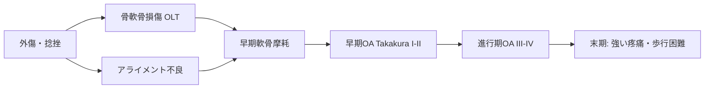

# 変形性足関節症：病態・診断

> 本ページは **病態** と **診断** を統合しています。

## 1. 特徴と疫学

- 大関節 OA の中では **股・膝に比べ二次性が多い**
- 主因: 過去の足関節骨折・靱帯損傷（**post-traumatic OA: 70–80%**）
- 一次性 OA は **10–15%** と少数
- 患者層: 30–70 代、外傷既往あり中高年が中心

## 2. 主因

| 病因 | 頻度 | 典型例 |
|------|------|--------|
| 足関節骨折既往 | 高 | Pilon 骨折、二・三果骨折 |
| 反復捻挫（CAI） | 高 | スポーツ歴、慢性不安定症 |
| 距骨骨軟骨損傷（OLT） | 中 | 蓄積性損傷 |
| 後足部アライメント異常 | 中 | 内反足、扁平足 |
| 関節リウマチ | 低 | 滑膜炎主体 |
| 痛風・血友病性関節症 | 稀 | 結晶誘発性／出血性 |

## 3. 病態の特徴

- 距腿関節中心の軟骨摩耗、骨棘形成
- **内反型が多い**（後足部内反、外側靱帯破綻、距骨内反傾斜）
- 距骨下関節・横足根関節への波及
- 前方インピンジメント（dorsal osteophyte）

## 4. 自然経過

- 進行性、ただし速度は個人差大
- 内反変形進行 → 立位不安定 → 隣接関節への二次負担
- 末期: 強い疼痛、歩行困難、就労継続困難

---

## 5. 病歴

| 項目 | ポイント |
|------|---------|
| 既往 | 足関節骨折・捻挫の **詳細と時期**（受傷から OA まで何年か） |
| 疼痛部位 | 前内側 / 前外側 / 後方（鑑別の手がかり） |
| 疼痛パターン | 歩き始め痛、活動後痛、夜間痛 |
| 機能 | 可動域制限の認識、跛行の出現時期 |
| 仕事・ADL | 立ち仕事の時間、階段昇降、長距離歩行可否 |
| 期待値 | 活動レベル・希望（後療法プロトコルに直結） |

## 6. 身体所見

- **跛行**（antalgic gait、内反変形による外側荷重）
- **後足部アライメント**（立位・荷重位での観察、内反/外反）
- **関節可動域**（背屈・底屈、健側比）
- 圧痛部位、骨棘の触知
- 関節水腫
- 距骨下関節・横足根関節の可動性
- 神経学的所見（腓骨神経）
- アキレス腱拘縮の有無（背屈制限の原因）

## 7. 画像検査

| 検査 | 目的 |
|------|------|
| **荷重位X線**（正面・側面・モーティス） | 標準。関節裂隙、骨棘、軸ずれ |
| 後足部アライメントビュー（Saltzman） | 後足部内反/外反角 |
| **Weight-bearing CT（WBCT）** | 3 次元評価、距骨下・後足部の正確な評価、術前計画に必須 |
| MRI | 軟骨・骨髄浮腫、術前精査 |
| ストレスX線 | 残存不安定性の評価 |

## 8. 分類

### 8-1. Takakura-Tanaka 分類（内反型）

| Stage | 所見 |
|-------|------|
| I | 早期硬化、軟骨保持 |
| II | 内側関節裂隙狭小化 |
| IIIa | 関節裂隙消失（前内側） |
| IIIb | 関節裂隙消失（内側全体） |
| IV | 距骨の傾き、関節破壊 |

### 8-2. COFAS Classification

- アライメントベース（内反 / 中立 / 外反）+ 隣接関節評価
- 術式選択（TAA 適応）の参考に有用

## 9. 鑑別

- 関節リウマチ・他炎症性関節炎
- 痛風・偽痛風
- 距骨壊死
- Charcot 関節（特に糖尿病性）
- 距骨骨軟骨損傷の単独病変
- 後脛骨筋腱機能不全（外反扁平足）

## 関連

- 次: [保存治療 →](conservative.md)
