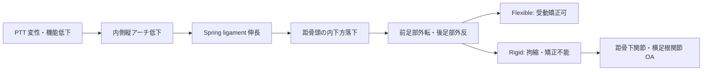

# 扁平足：病態・診断

> 本ページは **病態** と **診断** を統合しています。

## 1. 概念

**成人期扁平足障害（Adult Acquired Flatfoot Deformity, AAFD）** は、中年以降に **後脛骨筋腱機能不全（Posterior Tibial Tendon Dysfunction, PTTD）** を中心に、内側縦アーチが破綻して進行する後天的扁平足のスペクトラム。

## 2. 病態

### 2-1. 主因：後脛骨筋腱機能不全（PTTD）

- 後脛骨筋腱（PTT）の変性・部分断裂・完全断裂
- 加齢、過剰使用、血流不良域（zone of avascularity）の存在
- リスク因子: **女性、肥満、糖尿病、高血圧、関節リウマチ、ステロイド長期使用**

### 2-2. 進行のメカニズム

### 2-3. 軟部組織の連鎖破綻

| 構造 | 役割 | 破綻の影響 |
|------|------|----------|
| **PTT（後脛骨筋腱）** | アーチ保持の主役 | 機能不全で連鎖破綻のスタート |
| **Spring ligament**（底側踵舟靱帯） | 距骨頭支持 | 伸長 → 距骨頭落下 |
| **Deltoid 靱帯（内側）** | 後足部内側支持 | 後期に伸長 → 距骨外反傾斜 |
| **Plantar fascia** | アーチのタイバー | 二次的に過伸長・足底筋膜炎合併 |

## 3. 分類：Johnson-Strom 分類（修正 Myerson 含む）

| Stage | 病態 | アーチ | 矯正 | 主治療 |
|-------|------|--------|------|--------|
| **I** | PTT 腱炎、断裂なし | 正常 | — | 保存 |
| **II** | PTT 部分断裂、扁平足出現 | 低下 | **受動的矯正可（Flexible）** | 保存 → 靱帯再建+骨切り |
| **IIA** | 後足部外反のみ | 低下 | Flexible | 保存 → MDCO + FDL 移行 |
| **IIB** | 前足部外転（>30%） | 低下 | Flexible | 上記 + 外側柱延長 |
| **III** | 拘縮、後足部 OA 進行 | 著明低下 | **不能（Rigid）** | 三関節固定 |
| **IV** | 距骨外反傾斜、足関節 OA 合併 | 著明 | 不能 | TAA / 足関節固定 + 後足部処置 |

## 4. Flexible vs Rigid の判定（臨床的キーポイント）

!!! tip "ベッドサイドでの判定"
    - **Too many toes sign**（後方から見て足趾が外側に多く見える）
    - **Single heel rise test**（片脚踵上げ）：PTTD で実行困難。健側比で評価
    - **Double heel rise test** での後足部内反転位:
        - **Flexible** → 内反方向に転位する（アーチが受動的に戻る）
        - **Rigid** → 転位しない（拘縮）
    - 用手的に踵骨内反方向に矯正試行: Flexible は容易に矯正可
    - **片脚での内反不能** = Stage II 以上、PTT 機能不全確実

---

## 5. 病歴

| 項目 | ポイント |
|------|---------|
| 経過 | 緩徐進行、片側性（両側もあり）、左右差 |
| 疼痛部位 | **内側（PTT 走行）** が初期、後期は外側（fibular impingement） |
| 機能 | 長距離歩行困難、立位後痛、靴の内側摩耗 |
| リスク因子 | 女性中高年、肥満、糖尿病、RA、ステロイド使用 |
| 既往 | 足底筋膜炎、母趾外反、後足部捻挫 |

## 6. 身体所見

- 立位での **内側縦アーチ低下、外反踵、前足部外転**
- **Too many toes sign**
- **Single heel rise test**：片脚踵上げ不能 / 困難（PTT 機能評価）
- 内果後下方の圧痛・腫脹（PTT 周囲）
- アキレス腱拘縮（背屈制限）の有無：Silfverskiöld test
- 関節可動域：距骨下、横足根の柔軟性 → Flexible/Rigid 判定

## 7. 画像検査

### 7-1. 単純X線（**荷重位**）

| 指標 | 内容 | 正常／異常 |
|------|------|-----------|
| **Meary 角**（距骨-第1中足骨軸） | 側面で評価 | 正常 ≤ 4°、扁平足で増大（底側凸） |
| 踵骨ピッチ角（calcaneal pitch） | 側面 | 正常 ≥ 18°、扁平足で低下 |
| **Talo-navicular coverage angle** | 正面 | 前足部外転の指標 |
| 距舟関節適合性 | 正面 | 亜脱臼の有無 |

### 7-2. 後足部アライメント（Saltzman view）

- 後足部外反角の定量評価
- 術前計画（踵骨骨切り量）に必須

### 7-3. MRI

- PTT の変性、断裂（partial / complete）
- Spring ligament の状態
- 周囲滑膜炎
- 距骨下関節・横足根関節 OA

### 7-4. Weight-bearing CT（WBCT）

- 3 次元アライメント評価
- Subtalar joint subluxation の評価
- 進行例の術前計画

## 8. 鑑別

- 先天性扁平足（小児期から）
- Charcot 関節（糖尿病性、急速進行）
- 関節リウマチ性後足部破壊
- 足根骨癒合症（tarsal coalition）
- 神経筋疾患（CMT 等）

## 関連

- 次: [保存治療 →](conservative.md)
