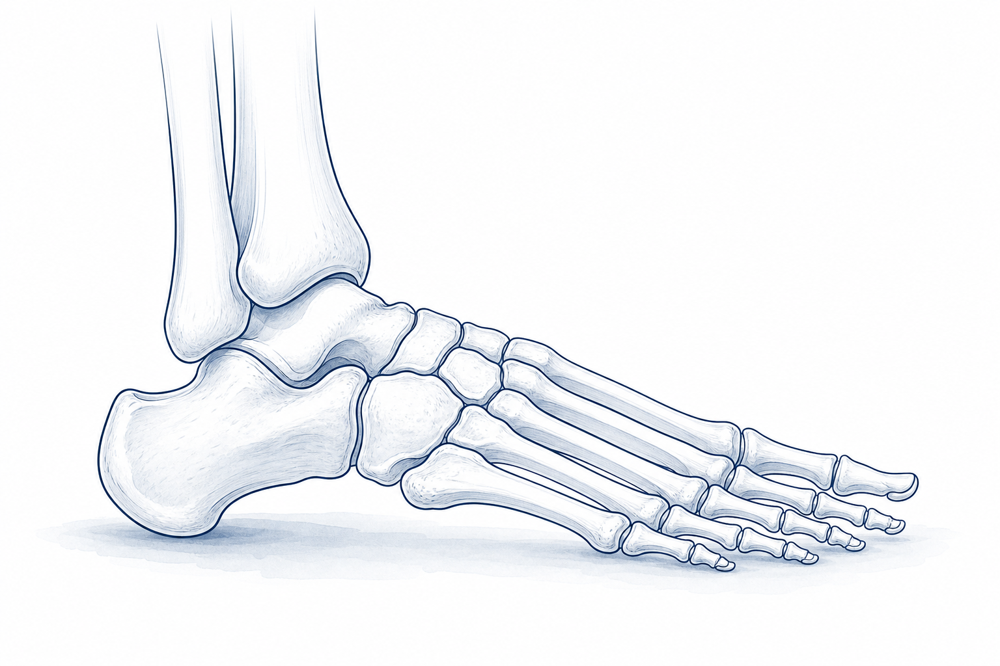

# OGAWA Foot Clinic — 足の外科 解説サイト

# 足の不安に、お答えします。

足首・足の病気と治療を、**患者さんにも医療スタッフにも** わかりやすくまとめました。
整形外科専門医・小川貴久（足の外科）が編集する、診療と教育のための解説サイトです。

<a class="cta cta--patient" href="patient/">
患者さん・ご家族の方
病気のしくみ、治療の流れ、入院・手術後の生活をやさしくご案内します。
こちらへ →
</a>

<a class="cta cta--pro" href="clinical/">
医療従事者の方
病態・診断、保存治療、手術術式、周術期管理を体系的に整理したリファレンス。
こちらへ →
</a>

---

## 取り扱う疾患

- :material-rotate-3d-variant: **足関節不安定症・足首の捻挫**

    ---
    捻挫を繰り返してぐらつく、年齢で足首がゆるんできた、という方へ。

    [患者さん向け](patient/ankle-instability.md) ／
    [医療従事者向け](clinical/ankle-instability/index.md)

- :material-foot-print: **外反母趾**

    ---
    親指の付け根が「く」の字に曲がり、靴を履くと痛い方へ。MICA / DMMO の解説。

    [患者さん向け](patient/hallux-valgus.md) ／
    [医療従事者向け](clinical/hallux-valgus/index.md)

- :material-bone: **変形性足関節症**

    ---
    過去のけがで足首の軟骨がすり減ってきた方へ。手術3種類の選び方。

    [患者さん向け](patient/ankle-osteoarthritis.md) ／
    [医療従事者向け](clinical/ankle-osteoarthritis/index.md)

- :material-shoe-print: **扁平足**

    ---
    土踏まずが落ち、内くるぶしの内側が痛い方へ。Flexible / Rigid 別の治療。

    [患者さん向け](patient/flatfoot.md) ／
    [医療従事者向け](clinical/flatfoot/index.md)

---

## 編集者

- **小川 貴久（Takahisa OGAWA）** M.D., MPH, Ph.D.
- 整形外科専門医／足の外科
- 修了フェローシップ:
    - Massachusetts General Hospital（Foot & Ankle Research & Innovation Lab）
    - Macquarie University Hospital（Limb Reconstruction Center）
    - Dalhousie University（Foot & Ankle Fellowship）
    - AOFAS Travelling Fellowship 2024

---

!!! warning "ご利用にあたって（免責事項）"
    本サイトは医療従事者・患者さんの学習を目的とした一般情報であり、個別の診断・治療判断に置き換わるものではありません。
    実際の診療は必ず主治医・担当医療チームの指示に従ってください。詳細は [免責事項](disclaimer.md) を参照。
