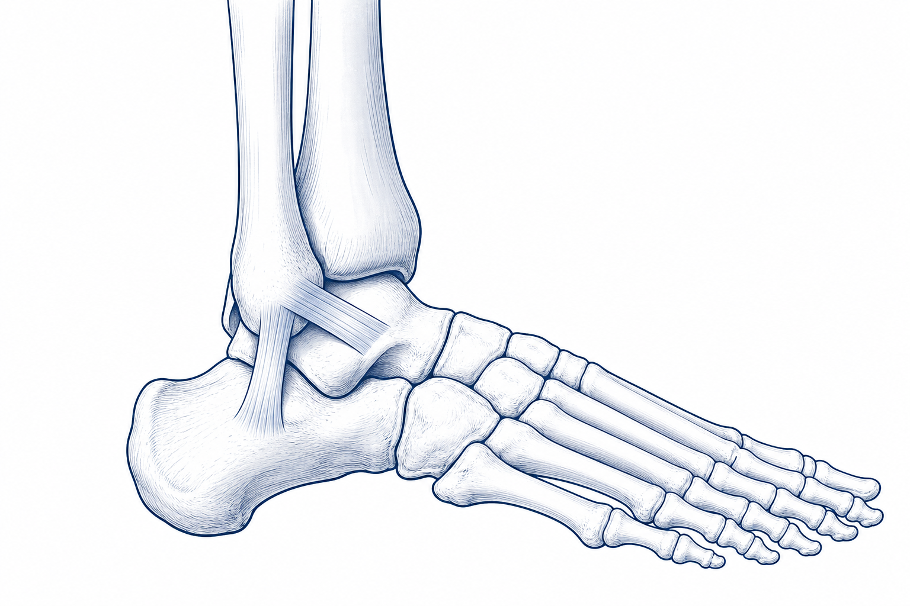
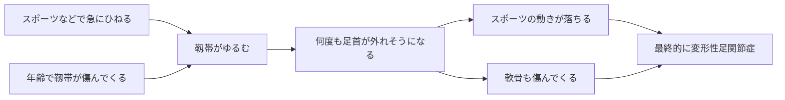

# 足関節不安定症・足首の捻挫

「捻挫がなかなか治らない」「最近、何もないところで足首が外れそうになる」「スポーツのキレが落ちた」 — そんなお悩みはありませんか。
このページでは、足首のぐらつきの原因と治療の選び方を、できるだけわかりやすくまとめました。

<figure class="figure-schema" markdown>

<figcaption>足首の外側を支える靱帯（じんたい）のイメージ図</figcaption>
</figure>

## 1. どんな病気？

足首の外側（くるぶしのほう）には、**靱帯（じんたい）** という丈夫な“ヒモ”があり、足首が内側にひねりすぎないように支えています。
この靱帯が傷んでゆるくなると、何度も足首をひねったり、ふとした拍子に「ガクッ」とする状態が続きます。これを **足関節不安定症** といいます。

### 「捻挫」と「足関節不安定症」は別の病気？

実は **同じスペクトラム（連続した1つの病気）** と考えます。
急に強くひねる捻挫の延長線上に、慢性的なぐらつきがあるイメージです。

### 原因は大きく2つ

- **① スポーツなどの急な捻挫**（若い方に多い）
- **② 加齢にともなう靱帯の傷み**（中高年に多く、はっきりした捻挫の記憶がないまま進むことも）

どちらも放っておくと、スポーツの動きが落ちる → 軟骨がすり減る → **変形性足関節症** へとつながることがあります。
だから「年のせい」と片付けず、一度ご相談いただきたい病気です。

### 慢性期の症状はとても弱く、見逃されやすいです

捻挫直後の腫れや痛みと違って、慢性期の症状はぼんやりしています。

- 何となく足首が不安
- 平らな道で「ガクッ」とする
- 長く歩いた後の、軽い鈍痛
- スポーツでの方向転換が苦手になった
- 軽く何度もひねる（でもよく覚えていない）

「ただ年のせい」と思って放置されている方も多いのですが、こうした症状は **治療できることがある** サインです。

---

## 2. 検査でわかること

| 検査 | わかること |
|------|------|
| 問診・診察 | 過去の捻挫、不安感、痛みの場所 |
| レントゲン | 骨折や変形がないか |
| ストレスレントゲン | 足首をひねった状態で撮り、ゆるみの程度を見る |
| MRI | 靱帯のいたみ具合、軟骨や腱の状態 |
| エコー | 動かしながらリアルタイムに評価 |

---

## 3. 治療の流れ

### 3-1. まずはリハビリで様子をみます

#### 急性期（捻挫直後）の方

- **POLICE処置**（保護・適切な負荷・冷却・圧迫・挙上）
- 早めに動かし始めることが大切です（昔の「とにかく安静」は古い考え方）
- サポーターをつけて段階的に体重をかけていきます

#### 慢性期の方

- 3か月以上のリハビリで、6〜7割の方は改善します
- 足首の動き、腓骨筋の筋力、バランス感覚を取り戻すトレーニング
- スポーツ時はサポーター・ブレースの活用

### 3-2. 手術を考えるとき

- リハビリを3〜6か月続けても **不安定感や痛みが残る**
- スポーツや仕事に **支障が大きい**
- 軟骨損傷など、追加の治療が必要なものが見つかった
- 加齢でゆるみが進み、明らかに歩きにくい

「手術はこわい」と感じる方も多いと思いますが、当院では **小さなカメラ（関節鏡）を使う、傷の小さい手術** を行っており、術後の負担はかなり軽くなっています。

---

## 4. 当院の手術：関節鏡視下 Broström

### 4-1. どんな手術？

- 数mmの小さな穴から **カメラ（関節鏡）** を入れて、ゆるんだ靱帯を縫い縮めて固定します
- 軟骨の傷など、ほかのトラブルも同時に治療できます
- 大きな傷を作らないので、回復が早く、傷あとも目立ちにくいのが利点です

### 4-2. 麻酔と入院

- 麻酔：全身麻酔 + 神経ブロック（術後の痛みを和らげるブロックを併用）
- 手術時間：1〜1.5時間
- 入院期間：数日（病院により異なります）

---

## 5. 手術後の生活（当院プロトコル）

!!! info "後療法のポイント"
    当院では早期回復を重視した、次のプロトコルで進めています。

    - **翌日から歩けます**（包帯・サポーターをつけたまま）
    - 抜糸：**10〜14日**
    - **包帯またはサポーター：6週間**
    - シャワー：濡らさなければ早期からOK、抜糸後はフリー
    - **6週間で仕事もスポーツも復帰** が目安

### 5-1. 入院中

| 時期 | 状態 |
|------|------|
| 当日〜翌日 | 足を高く上げて安静、痛み止めを使います |
| **翌日** | **歩行許可**（包帯・サポーターをつけた状態で） |
| 退院前 | 傷の管理、サポーターの扱い、危険サインを一緒に確認します |

### 5-2. 退院後のスケジュール

```mermaid
gantt
    title 術後の目安スケジュール
    dateFormat  X
    axisFormat  %s

    section 外固定
    包帯/サポーター     :a1, 0, 6
    スポーツ時ブレース  :a2, 6, 26

    section 荷重
    翌日から歩行       :b1, 0, 26

    section 活動
    日常生活           :c1, 0, 26
    職場復帰           :c2, 6, 26
    スポーツ復帰       :c3, 6, 26
```

| 時期 | 内容 |
|------|------|
| 翌日〜 | 包帯・サポーターで歩行可、足を高く上げる時間も確保 |
| 〜2週 | 抜糸（10〜14日）、自由に歩けます |
| 2〜6週 | サポーター継続、軽い運動・通勤可 |
| **6週〜** | **サポーター卒業、職場・スポーツ復帰** |
| 3〜6か月 | スポーツのときはブレース併用、段階的に強度UP |

### 5-3. お風呂・シャワー

| 時期 | シャワー | お風呂 |
|------|---------|------|
| 抜糸まで（〜10〜14日） | **濡らさなければOK**（防水カバー） | × |
| **抜糸後** | **濡らしてOK・自由** | **OK・自由** |

### 5-4. 自宅でのポイント

- 最初の2週間はできるだけ **足を心臓より高く** 上げて休んでください（むくみと痛みが軽くなります）
- 足の指は動かす運動を意識すると、血のめぐりが保たれます
- **タバコは創傷治癒に大きく影響します** ので、術前後はぜひ控えてください
- 抗血栓薬（血をサラサラにする薬）など、休んでいた薬の再開は **医師の指示に従って** ください

---

## 6. こんなときは病院にご連絡ください

!!! danger "すぐに病院へ"
    以下の症状は、感染や血流障害のサインのことがあります。「これくらいで」と遠慮せずに、夜間・休日でもご連絡ください。

    1. 痛みが急に強くなる、薬が効かない
    2. 足の指が **冷たい・しびれる・色が悪い**
    3. 包帯・サポーターの中が **きつくて痛い**
    4. 傷から **膿・悪臭・赤みが広がる**
    5. **38℃以上の発熱** が続く
    6. ふくらはぎが **腫れて痛い**（血栓のサイン）
    7. 急な **息切れ・胸の痛み**

---

## 7. よくいただくご質問

??? question "手術しないと、将来どうなりますか？"
    不安定なまま放っておくと、足首の **軟骨がすり減って** 変形性関節症へ進むことがあります。3か月以上のリハビリで改善しなければ、早めに手術を検討するほうが長期的によい結果につながります。とはいえ、手術を急ぐ必要は通常なく、ご自身のペースで決めて構いません。

??? question "本当に翌日から歩けるんですか？"
    はい。関節鏡を使う小さな傷の手術なので、組織への負担が少なく、しっかり固定できます。痛みのない範囲で、包帯・サポーターをつけて歩いていただきます。最初は短い距離から、少しずつで大丈夫です。

??? question "両足同時に手術できますか？"
    通常は片足ずつ行います。当院プロトコルなら翌日から歩けるので、片足ずつでも生活への影響は少なく済みます。

??? question "スポーツ復帰は、本当に6週間で大丈夫ですか？"
    軽めの活動（ジョギング、軽い筋トレ）は6週間が目安です。コンタクトスポーツや高強度の競技は、3〜6か月かけて段階的に戻していきます。復帰後 **6〜12か月はブレース** をつけていただくと、再受傷予防になります。

??? question "傷あとは目立ちますか？"
    関節鏡の傷は **数mm** なので、半年〜1年でほぼ目立たなくなります。

??? question "保険・費用は？"
    日本国内では保険診療の対象です。**高額療養費制度** を使えば月の自己負担が大きく軽減されます。詳しくは病院の医療相談室にご相談ください。

??? question "「症状は弱いが不安」というだけでも、受診していいですか？"
    もちろん大丈夫です。慢性期の症状はわかりにくく、本人も病院も見逃しがちです。「年のせい」と決めつけず、ぜひ一度ご相談ください。

---

## 関連ページ

- [医療従事者向け：足関節不安定症（病態・治療）](../clinical/ankle-instability/index.md)
- [患者さん向けトップ](index.md)
