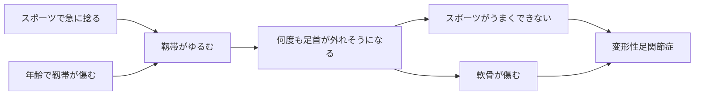

# 足関節不安定症・足首の捻挫

!!! abstract "このページのまとめ"
    - 「足首の捻挫」と「足首がぐらぐらする病気（足関節不安定症）」は **同じ病気の連続したもの** です
    - 原因は2つ：**①スポーツでの急な捻挫**、**②加齢で靱帯がゆるむ**。どちらも放っておくと、**スポーツの動きが落ちる** → 最終的に **変形性足関節症（足首の軟骨がすり減る病気）** につながります
    - **慢性期の症状はとても弱く、見逃されやすい** のが特徴です（漠然と不安、軽く何度も捻る、長く歩いた後の鈍痛）
    - 治療の基本はリハビリ。改善しないときは手術
    - 当院の手術は **関節鏡（カメラ）** を使う小さな傷の手術。**翌日から歩けます**。**抜糸は10〜14日**、**包帯やサポーターは6週間**、**6週間で仕事もスポーツも復帰** が目安です

---

## 1. どんな病気？

### 足首の構造

足首の外側（くるぶしの方）には、**靱帯** という丈夫なヒモのような組織があり、足首が内側にひねりすぎないように支えています。
代表的な靱帯が **前距腓靱帯（ATFL）** と **踵腓靱帯（CFL）** です。

### 2つの原因

- **①スポーツでの急な捻挫**（若い人に多い）
- **②加齢による靱帯の傷み**（中高年に多い、はっきりした捻挫の記憶なく進む）

### よくある症状

#### 急性期（捻挫直後）

- 強い痛み、腫れ
- 足が地面につけない
- 内出血（青あざ）

#### 慢性期（**症状が弱く、見逃されやすい**）

- 漠然と「足首が不安」
- 平らな道でも「ガクッ」とする
- 長く歩いた後に鈍く痛い
- スポーツでの方向転換が苦手になった
- 軽く何度も捻る（でも本人もよく覚えていない）

!!! warning "見逃さないために"
    「年のせい」「もとからこんなもの」と思って病院に行かない方が多いですが、放置すると **変形性足関節症に進む** リスクが高くなります。
    既往に捻挫があり、上記のような症状がある方は一度受診を。

---

## 2. 検査

外来では以下を行います。

| 検査 | 目的 |
|------|------|
| 問診・診察 | 捻った回数、不安定感、痛みの場所を確認 |
| レントゲン | 骨折や変形がないか |
| ストレスレントゲン | 足首をひねった状態で撮り、ゆるみの程度を見る |
| MRI | 靱帯のいたみ具合、軟骨や腱の合併損傷を確認 |
| エコー | 外来で動かしながらリアルタイムに評価 |

---

## 3. 治療

### 3-1. まず保存治療

#### 急性期（捻挫直後）

- **POLICE処置**（保護・適切な負荷・冷却・圧迫・挙上）
- 早めに動かし始めることが大事（昔の「完全安静」は古い）
- サポーターで段階的に荷重

#### 慢性期

- **3か月以上のリハビリ**
- 足首の **可動域** を広げる
- **腓骨筋** などの筋力をつける
- **バランス訓練**（片足立ち、不安定な面で立つ）
- スポーツ時は **サポーター・ブレース** を使う

これで6〜7割の方は症状がよくなります。

### 3-2. 手術を考えるとき

- リハビリを **3〜6か月** 続けても **不安定感や痛み** が残る
- スポーツや仕事に **支障が大きい**
- 軟骨損傷など、追加の治療が必要なものがある
- 加齢で靱帯のゆるみが進み、明らかに歩きにくい

---

## 4. 当院の手術：関節鏡視下 Broström

### 4-1. 関節鏡（カメラ）を使う手術

- 数 mm の小さな穴から **カメラ（関節鏡）** を入れて手術します
- ゆるんでしまった靱帯を **縫い縮めて** 足首を安定化
- **軟骨の傷など他のトラブルも同時に治療** できます
- 大きな傷を作らないので **回復が早く**、**目立つ傷も残りにくい**

### 4-2. 手術の流れ

- 麻酔: 全身麻酔 + 神経ブロック
- 手術時間: 1〜1.5 時間
- 入院期間: 数日（施設により）

---

## 5. 手術後の生活（当院プロトコル）

!!! info "後療法のポイント"
    - **翌日から歩けます**（包帯・サポーターをつけたまま）
    - 抜糸: **10〜14日**
    - **包帯またはサポーター: 6週間**
    - シャワー: **濡らさなければ早期からOK**、**抜糸後はフリー**
    - **6週間で仕事もスポーツも復帰**

### 5-1. 入院中

| 時期 | 状態 |
|------|------|
| 当日〜翌日 | 足を高く上げて安静、痛み止め |
| **翌日** | **歩行許可**（包帯・サポーター装着下で） |
| 退院前 | 傷の管理、サポーターの扱い、危険サインを学ぶ |

### 5-2. 退院後のスケジュール

```mermaid
gantt
    title 術後の目安スケジュール（当院プロトコル）
    dateFormat  X
    axisFormat  %s

    section 外固定
    包帯/サポーター     :a1, 0, 6
    スポーツ時ブレース  :a2, 6, 26

    section 荷重
    翌日から歩行       :b1, 0, 26

    section 活動
    日常生活           :c1, 0, 26
    職場復帰           :c2, 6, 26
    スポーツ復帰       :c3, 6, 26
```

| 時期 | 内容 |
|------|------|
| 翌日〜 | 包帯・サポーターで歩行可、足を高く上げる時間も確保 |
| 〜2 週 | 抜糸（10〜14日）、自由歩行 |
| 2〜6 週 | サポーター継続、軽い運動・通勤可 |
| **6 週〜** | **サポーター卒業、職場・スポーツ復帰** |
| 3〜6 か月 | スポーツのときはブレース併用、段階的に強度UP |

### 5-3. お風呂・シャワー

| 時期 | シャワー | お風呂 |
|------|---------|------|
| 抜糸まで（〜10〜14日） | **濡らさなければOK**（防水カバー） | × |
| **抜糸後** | **濡らしてOK・自由** | **OK・自由** |

### 5-4. 自宅でのポイント

- 最初の2週間は **足を心臓より高く**（むくみ・痛みを抑える）
- **足の指を動かす運動**（血栓予防）
- **タバコは厳禁**（傷の治りが遅れます）
- 抗血栓薬（血をサラサラにする薬）など、休止していた薬は **医師の指示で再開**

---

## 6. こんなときは病院に連絡

!!! danger "すぐ病院へ"
    - 痛みが急に強くなり、薬が効かない
    - 足の指が **冷たい・しびれる・色が悪い**
    - 包帯・サポーターの中が **きつくて痛い**
    - 傷から **膿・悪臭・赤みが広がる**
    - **38℃以上の発熱** が続く
    - ふくらはぎが **腫れて痛い**（血栓のサイン）
    - 急な **息切れ・胸の痛み**

---

## 7. よくある質問

??? question "手術しないと将来どうなりますか？"
    不安定感を放置すると、足首の **軟骨がすり減って** 変形性関節症に進むことがあります。3か月以上のリハビリで改善しなければ、早めの手術を検討する方が長期的には良いです。

??? question "両足同時に手術できますか？"
    通常は片足ずつ行います。当院プロトコルなら翌日から歩けるので、片足ずつでも生活への影響は少ないです。

??? question "本当に翌日から歩けるんですか？"
    はい、関節鏡を使う小さな傷の手術なので、組織の損傷が少なく、しっかり固定できるため翌日から歩行が可能です。包帯・サポーターを装着した状態で、痛みのない範囲で歩いていただきます。

??? question "スポーツ復帰はいつですか？"
    軽い活動は **6週間** で可能です。コンタクトスポーツや高強度の競技は、3〜6か月かけて段階的に復帰し、復帰後 **6〜12か月はブレース** を勧めます。

??? question "傷あとは目立ちますか？"
    関節鏡の穴は **数 mm** なので、半年〜1年でほぼ目立たなくなります。

??? question "保険・費用は？"
    日本国内では保険診療の対象です。高額療養費制度を使えば月の自己負担が軽減されます。

---

## 関連ページ

- [医療従事者向け：足関節不安定症（病態・治療）](../clinical/ankle-instability/index.md)
- [患者さん向けトップ](index.md)
