# 足関節不安定症（足首がぐらぐらする病気）

!!! abstract "このページのまとめ"
    - 捻挫を繰り返すうちに、足首を支える靱帯（じんたい）がゆるんで **足首が不安定** になる病気です
    - まず **リハビリ（運動療法）を3か月以上** 行い、改善しないときに手術を検討します
    - 手術は **靱帯を縫い縮める方法**（ブロストロム法）が標準で、傷も小さく、9割以上の患者さんで満足のいく結果が得られます
    - 術後は **約2週間ギプス → 4〜6週間ブーツ → 3〜6か月でスポーツ復帰** が目安です

---

## 1. どんな病気？

### 足首の構造

足首の外側（くるぶしの方）には、**靱帯** という丈夫なヒモのような組織があり、足首が内側にひねりすぎないように支えています。
代表的な靱帯が **前距腓靱帯（ATFL）** と **踵腓靱帯（CFL）** です。

### 足首をひねると…

スポーツや段差で足首を内側にひねると、これらの靱帯が傷つきます（いわゆる **捻挫**）。
多くの捻挫はリハビリで治りますが、**しっかり治さないと靱帯がゆるんだまま** になり、

- 些細なことで足首が **「ガクッ」** と外れる感じがする
- スポーツや歩行で **不安** になる
- **痛みが続く** ・ **腫れやすい**

といった症状が残ります。これが **慢性足関節不安定症（CAI）** です。

---

## 2. 検査

外来では以下を行います。

| 検査 | 目的 |
|------|------|
| 問診・診察 | ひねった回数、不安定感、痛みの場所を確認 |
| レントゲン | 骨折や変形がないか |
| ストレスレントゲン | 足首をひねった状態で撮り、ゆるみの程度を見る |
| MRI | 靱帯のいたみ具合、軟骨や腱の合併損傷を確認 |
| エコー | 外来で動かしながらリアルタイムに評価 |

---

## 3. 治療の選択肢

### 3-1. まずはリハビリ（保存療法）

**最低3か月** のリハビリをまず行います。

- 足首の **可動域** を広げる
- **腓骨筋** などの筋力をつける
- **バランス訓練**（片足立ち、不安定な面で立つ）
- スポーツ時は **サポーター・ブレース** を使う

これで6〜7割の方は症状がよくなります。

### 3-2. 手術を検討するとき

- リハビリを3〜6か月続けても **不安定感や痛みが残る**
- スポーツや仕事で **支障が大きい**
- 軟骨損傷など、追加の治療が必要なものがある

---

## 4. 手術について

### 4-1. 標準術式：ブロストロム法（Modified Broström-Gould）

足首の外側に **4〜6cm の傷** を作り、ゆるんでしまった靱帯を **縫い縮める** 手術です。
さらに **伸筋支帯** という別の組織で補強します。

- 自分の組織を使うので **大きな違和感が残りにくい**
- 9割以上で良好な結果
- 関節鏡（カメラ）で **より小さな傷** で行う方法もあります

### 4-2. 関節鏡視下手術

カメラを使い、数か所の小さな傷から行う方法。同時に **軟骨損傷の処置** などもできます。

### 4-3. 靱帯再建術

靱帯のいたみが強い、繰り返し手術している、関節がゆるい体質などの場合、
**他の腱（自分のもの・提供されたもの）** を使って靱帯を作り直します。

### 4-4. 麻酔と入院期間

- 麻酔: **全身麻酔 + 神経ブロック** が一般的
- 手術時間: **1〜1.5 時間** ほど
- 入院期間: **3〜7日** ほど（施設による）

---

## 5. 手術後の生活

### 5-1. 入院中

| 時期 | 状態 |
|------|------|
| 当日〜翌日 | **足を高く上げて安静**、痛み止め、トイレは介助 |
| 2〜3日目 | 松葉杖で **足をつかない歩行** を練習 |
| 退院前 | 傷の管理、シーネ（ギプス）の扱い、危険サインを学ぶ |

### 5-2. 退院後のスケジュール

```mermaid
gantt
    title 術後の目安スケジュール
    dateFormat  X
    axisFormat  %s

    section 外固定
    シーネ          :a1, 0, 2
    ブーツ装具      :a2, 2, 6
    ブレース        :a3, 6, 26

    section 荷重
    非荷重          :b1, 0, 2
    部分荷重        :b2, 2, 4
    全荷重          :b3, 4, 26

    section 活動
    日常生活        :c1, 6, 12
    ジョギング      :c2, 12, 16
    スポーツ復帰    :c3, 16, 26
```

| 時期 | 内容 |
|------|------|
| 〜2週 | シーネ、松葉杖で非荷重、抜糸 |
| 2〜6週 | ブーツ装具、徐々に体重をかける |
| 6週〜3か月 | ブーツ卒業、筋力・バランス訓練 |
| 3〜6か月 | スポーツ復帰（ブレース着用） |

### 5-3. 自宅でのポイント

- **足を心臓より高く** 上げる時間を多く（特に最初の2週間）
- **足の指を動かす** 運動（むくみ・血栓予防）
- **入浴**は抜糸後・傷が乾いてから（それまではシャワーを防水カバーで）
- **タバコは厳禁**（傷の治りが遅れます）
- 抗血栓薬（血をサラサラにする薬）など、休止していた薬は **医師の指示で再開**

---

## 6. こんなときは病院に連絡

!!! danger "すぐ病院へ"
    - 痛みが急に強くなり、薬が効かない
    - 足の指が **冷たい・しびれる・色が悪い**
    - シーネ・ブーツの中が **きつくて痛い**
    - 傷から **膿・悪臭・赤みが広がる**
    - **38℃以上の発熱** が続く
    - ふくらはぎが **腫れて痛い** （血栓のサイン）
    - 急な **息切れ・胸の痛み**

---

## 7. よくある質問

??? question "手術しないと将来どうなりますか？"
    不安定感を放置すると、足首の **軟骨がすり減って** 変形性関節症に進むことがあります。3か月以上のリハビリで改善しなければ、早めの手術を検討する方が長期的にはよいことが多いです。

??? question "両足同時に手術できますか？"
    通常は片足ずつ行います。両足とも体重をかけられない期間が長くなるためです。

??? question "スポーツ復帰はいつですか？"
    軽いジョギングは3か月、スポーツ完全復帰は **4〜6か月** が目安です。復帰時は **6〜12か月はブレース** を勧めます。

??? question "傷あとは目立ちますか？"
    外側くるぶし前の **4〜6cm** の傷ですが、皮膚のしわに沿わせるため、半年〜1年で目立ちにくくなります。

??? question "保険・費用は？"
    日本国内では保険診療の対象です。高額療養費制度を使えば月の自己負担が軽減されます。詳しくは病院の医療相談室にご相談ください。

---

## 関連ページ

- [医療従事者向け：足関節不安定症（病態・治療）](../clinical/ankle-instability/index.md)
- [患者さん向けトップ](index.md)
