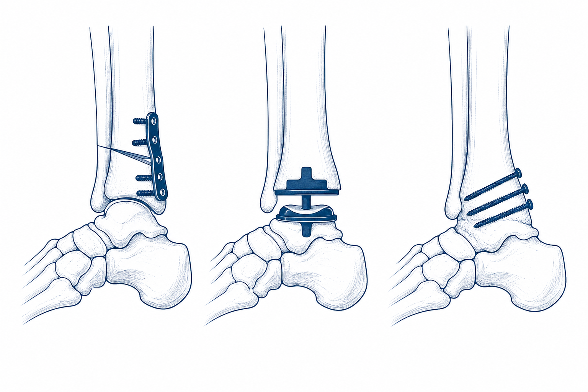
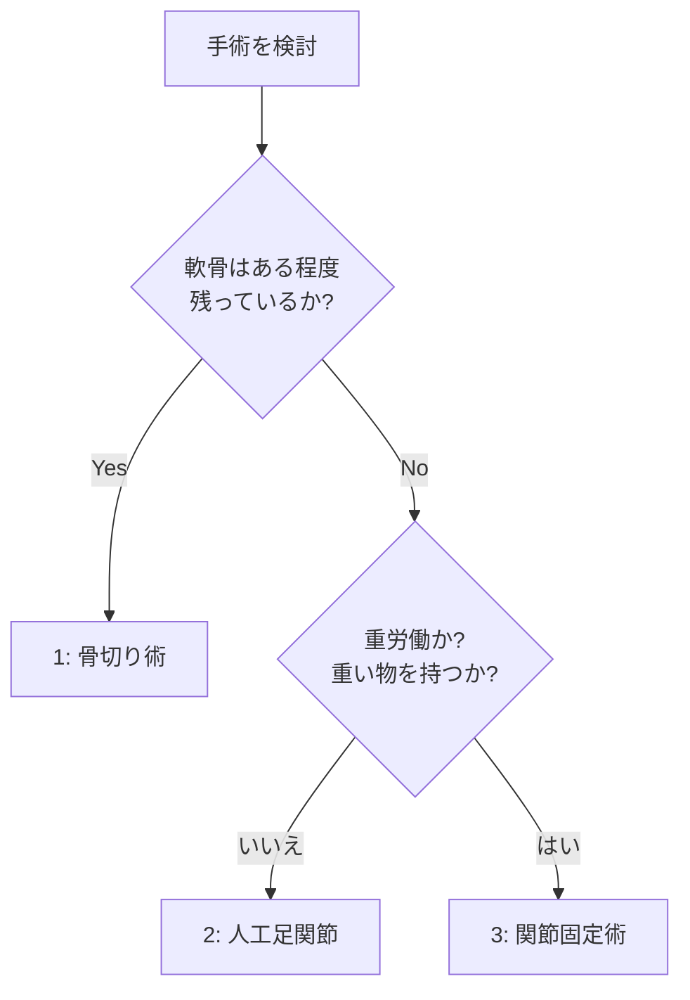

# 変形性足関節症

「歩き始めに足首が痛い」「昔の骨折のあと、何年も経ってから痛みが出てきた」「だんだん長く歩けなくなってきた」 — こうしたお悩みでお越しになる方が多い病気です。
手術の話を聞くと身構えてしまいますが、まずは **保存治療（手術以外の治療）** から始めて、ご自身のペースで選んでいただける病気です。
このページでは、変形性足関節症の特徴と、3種類の手術の選び方を、できるだけわかりやすくお話しします。

## 1. どんな病気？

足首の関節の **軟骨がすり減って** 痛み・動きにくさが出る病気です。
膝や股関節と違い、**過去のけが（足首の骨折・捻挫）が主な原因** であることが多いのが特徴です。

### こんなお悩みありませんか？

- 朝起きたとき、最初の一歩が痛い
- 動かすと痛いし、可動域が狭くなった気がする
- 朝はこわばっている
- 進行すると、安静にしていても痛い
- 足首が内側に傾いてきた（内反変形）

「年だから仕方ない」と思って我慢されている方も多いのですが、**進行を遅らせる治療** や **痛みを取る手術** がありますので、つらいときは一度ご相談ください。

## 2. 検査でわかること

- レントゲン（**立った状態で撮ります**）— 軟骨のすり減り具合、変形の程度
- CT（最近は **荷重位 CT** が普及）— 3次元で立体的に評価
- MRI — 軟骨、骨の中の状態

---

## 3. 治療

### 3-1. まずは保存治療

すべての段階で **まず保存治療** から始めます。

- **体重コントロール**（とても大切です）
- 痛み止め（飲み薬・湿布）
- 装具（足首サポーター、足底板、特殊な靴）
- **関節注射**（ヒアルロン酸、ステロイド）
- リハビリ（可動域、筋力、歩行）

これだけで、長く付き合える方もたくさんいらっしゃいます。

### 3-2. 手術を考えるとき

- 半年〜1年の保存治療でも痛みが取れない
- 軸ずれ（足首が傾く）が進む
- 末期で、歩くことが困難になってきた

---

## 4. 手術の3つの選択肢

進行度・年齢・活動性・ご希望によって、3つの中から選びます。当院では、できるだけ **ご自身の関節を残せる手術から順に** 検討します。

<figure class="figure-schema" markdown>

<figcaption>左：骨切り術（プレートで固定し、傾きを直す）／中央：人工足関節置換術（人工部品で関節を置き換える）／右：関節固定術（スクリューで骨同士をくっつける）</figcaption>
</figure>

### 4-1. ① 骨切り術（第1の選択肢）

- **自分の関節を残せる、唯一の手術** です
- 足首の少し上で骨を切り、傾きを真っ直ぐに直して、関節への負担を減らします
- 自分の関節が残るので、動きも自然です
- **デメリット**：時間とともに症状が進むことがあります
- もし将来、効果が薄れても **人工足関節や関節固定にステップアップ** できる、というのも大きな利点です

### 4-2. ② 人工足関節置換術（第2の選択肢）

- 痛んだ関節を **人工の関節（チタン・ポリエチレン）** に置き換えます
- **足首が動くまま** 生活できる
- 歩き方も自然に保てます
- **デメリット・注意点**：
    - **重労働や重い物を持つお仕事には注意** が必要です（人工関節がゆるんだり壊れたりすることがあります）
    - 10〜20年で **再手術が必要** になる方もいらっしゃいます
    - 衝撃の強いスポーツは控えていただきます

### 4-3. ③ 関節固定術（最終手段だが確実）

- 足首の関節を **骨でくっつけて、動かなくする** 手術です
- 痛みは **ほぼ確実に取れます**（これが最大のメリット）
- 長持ちします（数十年）
- **デメリット**：
    - 足首が動かなくなります
    - 不整地が歩きにくい
    - 10〜20年で **隣の関節（距骨下関節）** が悪くなってくることがあります

「足首が動かないなんて…」と心配される方も多いですが、実際には **歩くのにそこまで支障はありません**。痛みを確実に取りたい、重労働を続けたい、という方には有効な選択肢です。

### 4-4. 固定術と人工関節、どちらがいい？

| 比較項目 | 関節固定術 | 人工足関節（TAA） |
|------|----------|-------------|
| 痛みを取る確実性 | ◎ ほぼ確実 | ○ 約9割で良好 |
| 足首の動き | 動かない | 動かせる |
| 長持ち | 数十年 | 10〜20年 |
| 重労働 | 可能 | 控えていただきます |
| ランニング | × | × |
| 不整地歩行 | やや困難 | 普通 |
| 隣の関節への影響 | 長期で悪化リスク | 比較的少ない |
| 再手術 | 通常不要 | 必要になることあり |

患者さんの **年齢・体重・お仕事・スポーツ・骨の状態** によって、最適な選択は変わります。「これだけが正解」というものはなく、 **ご一緒に考えながら決めていきます**。

---

## 5. 手術後の生活

### 5-1. 骨切り術のあと

- 6週間 **足をつきません**（非荷重、松葉杖）
- その後、骨のくっつき具合を見ながら、段階的に体重をかけていきます
- フリーに歩けるのは 3か月後くらい

### 5-2. 人工足関節置換術のあと

- 装具をつけて、2〜4週から徐々に体重をかけ始めます
- 4週で全体重をかけられるようになります
- 3〜6か月で、日常生活はほぼ問題なし
- 衝撃の強いスポーツは原則お控えいただきます

### 5-3. 関節固定術のあと

- 6〜12週 **足をつきません**（骨がくっつくまで）
- その後、段階的に体重をかけていきます
- 3〜6か月でほぼ復帰
- 不整地・階段は少しコツがいります

---

## 6. 注意していただきたいこと

- **禁煙** は手術成功のためにとても重要です（特に固定術と骨切り術）
- 糖尿病・末梢循環障害がある方は、感染リスクが上がるためコントロールを強化します
- **手術前に、お仕事の内容・趣味・将来したいこと** を主治医に詳しくお伝えください（術式選びに直結します）

---

## 7. こんなときは病院にご連絡ください

!!! danger "すぐ病院へ"
    以下の症状は、感染や血流障害のサインのことがあります。遠慮なくご連絡ください。

    - 急な強い痛み、薬が効かない
    - 足の指のしびれ・冷感・色が悪い
    - 包帯・装具の中がきつくて痛い
    - 傷から膿・悪臭・赤みが広がる
    - 38℃以上の発熱
    - ふくらはぎが腫れて痛い（血栓のサイン）
    - 急な息切れ・胸の痛み

---

## 8. よくいただくご質問

??? question "保存治療を、いつまで続ければいいですか？"
    通常 **6か月〜1年** で改善するかどうかで判断します。痛みでお仕事や日常生活に大きく支障があれば、もっと早く手術検討をご相談する場合もあります。

??? question "若い人でも手術できますか？"
    可能です。お若い方は **骨切り術** をまず考えます。自分の関節を残せるため、長期的に有利な選択になりやすいです。

??? question "両足ともOAなのですが、同時手術はできますか？"
    通常は片足ずつです。両足とも体重をかけられない期間が長くなると、生活が困難になってしまうためです。

??? question "手術しないとどうなりますか？"
    進行性の病気ですので、徐々に痛みが強くなり、歩行が困難になっていきます。ただし進行のスピードには **個人差が大きく**、保存治療でうまく付き合えれば手術不要な方もたくさんいらっしゃいます。

??? question "人工関節って、何年もつのですか？"
    最新の機種では **10〜20年** で約 8〜9割の方が問題なく使用できるとされています。ただし、活動性・体重・使い方で大きく変わりますので、定期的なレントゲンチェックで状態を確認します。

??? question "費用は？"
    日本では保険診療の対象です。人工関節は **高額療養費制度** が適用され、月の自己負担額に上限が設けられます。詳しくは医療相談室へ。

??? question "妻（夫）にどう説明すればいいか不安です…"
    手術内容や術後の生活については、ご家族の方も一緒に診察にお越しいただいて構いません。当院では、ご家族の方への説明の時間も別途設けることができます。お気軽にご相談ください。

---

## 関連ページ

- [医療従事者向け：変形性足関節症](../clinical/ankle-osteoarthritis/index.md)
- [患者さん向けトップ](index.md)
