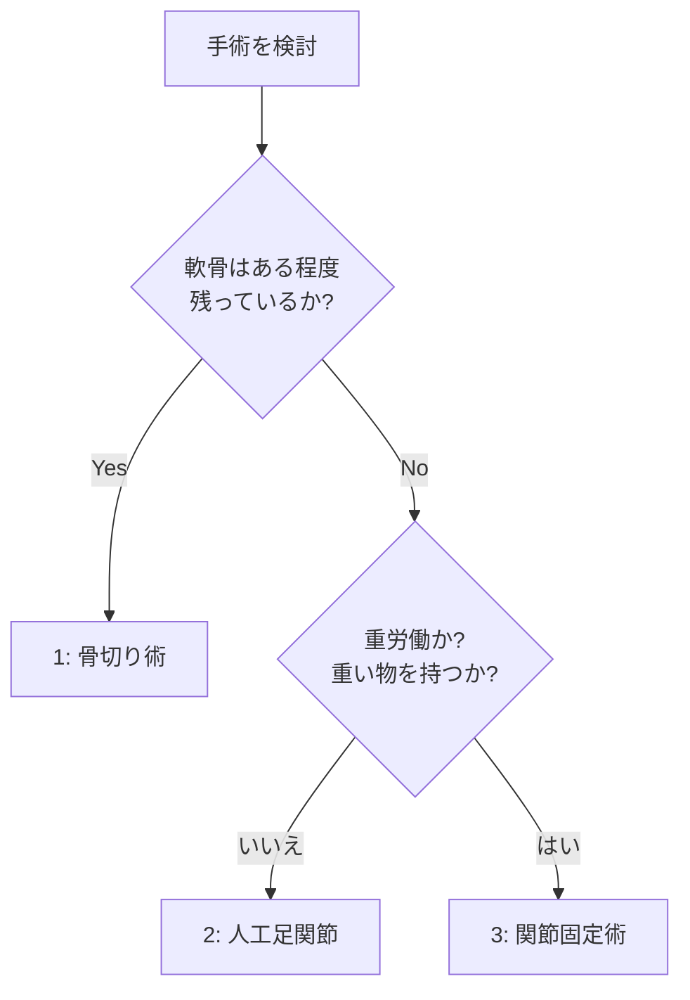

# 変形性足関節症

!!! abstract "このページのまとめ"
    - 足首の関節の **軟骨がすり減って痛みや動きにくさが出る** 病気です
    - 膝・股関節と違い、**過去のけが（足首の骨折・捻挫）が主な原因** です
    - 保存治療（体重管理・装具・注射・リハビリ）が基本
    - 手術は **重症度・日常生活・年齢・希望する活動レベル** で選びます
    - **当院の手術の順番は：①骨切り術 → ②人工足関節 → ③関節固定術**
        - **骨切り術**：**自分の関節を残せる唯一の手術**。ただし時間が経つと症状が進む可能性あり
        - **人工足関節**：足首を動かせる。**重い物を持つ仕事・重労働の方には注意**
        - **関節固定術**：**最終手段だが、痛みは確実に取れる**

---

## 1. どんな病気？

足首の関節の **軟骨がすり減って** 痛み・動きにくさを起こす病気です。
膝や股関節と違い、**過去のけが**（足首の骨折・捻挫の積み重ね）が原因の方が多いのが特徴です。

## 2. 症状

- 歩き始めの痛み
- 動かすと痛い、可動域が狭くなる
- 朝のこわばり
- 進行すると **安静時にも痛む**
- 足首が変形して内側に傾く（内反変形）

## 3. 検査

- レントゲン（**立った状態で撮ります**）
- CT（最近は **荷重位 CT** が普及）
- MRI（軟骨の状態を見る）

## 4. 治療

### 4-1. まず保存治療

すべての段階で **まずは保存治療** から始めます。

- **体重コントロール**（最重要）
- 痛み止め（飲み薬・湿布）
- 装具（足首サポーター、足底板、特殊な靴）
- **関節注射**（ヒアルロン酸、ステロイド）
- リハビリ（可動域、筋力、歩行）

### 4-2. 手術を考えるとき

- 半年〜1年の保存治療でも痛みが取れない
- 軸ずれが進む
- 末期で歩行困難になっている

---

## 5. 手術の選択肢（3種類）と当院の順番

進行度・年齢・活動性・希望によって選びます。

### 5-1. ① 骨切り術（推奨第1選択）

- **自分の関節を残せる唯一の手術**
- 足首の少し上で骨を切り、傾きを真っ直ぐに直して関節への負担を減らす
- **デメリット**：時間とともに症状が進む可能性がある
- 失敗しても、次の人工足関節や関節固定に **「ステップアップ」できる**

### 5-2. ② 人工足関節置換術（推奨第2選択）

- 痛んだ関節を **人工の関節（チタン・ポリエチレン）** に置き換える
- **足首が動くまま** で生活できる
- 歩き方が自然になる
- **デメリット・注意点**：
    - **重労働や重い物を持つ仕事には注意**（人工関節がゆるんだり壊れたりする可能性）
    - 10〜20年で **再手術が必要になることも**
    - スポーツは低衝撃のもののみ

### 5-3. ③ 関節固定術（推奨第3／最終手段）

- 足首の関節を **骨でくっつけて動かなくする**
- 痛みは **ほぼ確実に取れる**（最大のメリット）
- 長持ちする（数十年）
- **デメリット**：
    - 足首が動かなくなる
    - 不整地が歩きにくい
    - 10〜20 年で **隣の関節（距骨下関節）が悪くなる** 可能性

### 5-4. 固定術と人工関節、どちらがいい？

| 比較 | 関節固定術 | 人工足関節（TAA） |
|------|----------|-------------|
| 痛みを取る確実性 | ◎ ほぼ確実 | ○ 9割で良好 |
| 足首の動き | 動かない | 動かせる |
| 長持ち | 数十年 | 10〜20年 |
| 重労働 | 可能 | 推奨されない |
| ランニング | 不可 | 不可〜慎重 |
| 不整地歩行 | 困難 | 普通 |
| 隣の関節への影響 | 長期で悪化リスク | 比較的少 |
| 再手術 | 通常不要 | 必要になることあり |

患者さんの **年齢・体重・仕事・スポーツ・骨の状態** によって、最適な選択は変わります。

---

## 6. 手術後の生活

### 6-1. 骨切り術後

- 6 週間 **足をつかない**（非荷重、松葉杖）
- その後、骨のくっつき具合で段階的に体重をかけていく
- フリーに歩けるのは 3 か月後くらい

### 6-2. 人工足関節置換術後

- 装具で 2〜4 週から徐々に荷重開始
- 4 週で全荷重を目指す
- 3〜6 か月で日常生活はほぼ問題なし
- ハイインパクトのスポーツは原則できない

### 6-3. 関節固定術後

- 6〜12 週 **足をつかない**（骨癒合まで）
- その後、段階的に荷重
- 3〜6 か月でほぼ復帰
- 不整地・階段は少しコツがいる

---

## 7. 注意点

- **禁煙** は手術成功のために非常に重要です（特に固定術と骨切り術）
- 糖尿病・末梢循環障害は感染リスクを上げます
- **人工関節は強い衝撃のスポーツ（ランニング、球技）は控える** ことが多いです
- 手術前に **仕事内容・趣味・将来したいこと** を主治医に詳しく伝えてください（術式選択に直結します）

---

## 8. こんなときは病院に連絡

!!! danger "すぐ病院へ"
    - 急な強い痛み、薬が効かない
    - 足の指のしびれ・冷感・色が悪い
    - 包帯・装具の中がきつくて痛い
    - 傷から膿・悪臭・赤みが広がる
    - 38℃以上の発熱
    - ふくらはぎが腫れて痛い（血栓のサイン）
    - 急な息切れ・胸の痛み

---

## 9. よくある質問

??? question "保存治療をいつまで続ければいいですか？"
    通常 **6か月〜1年** で改善するかどうかで判断します。痛みで仕事や日常生活に大きく支障があれば、もっと早く手術検討する場合もあります。

??? question "若い人でも手術できますか？"
    可能です。若い方は **骨切り術** を第一に考えます。自分の関節を残せるため、長期的に有利です。

??? question "両足ともOAなのですが、同時手術はできますか？"
    通常は片足ずつです。両足とも体重をかけられない期間が長くなるため、生活が困難になります。

??? question "手術しないとどうなりますか？"
    進行性の病気ですので、徐々に痛みが強くなり、歩行が困難になっていきます。ただし進行速度は個人差が大きいので、保存治療でうまく付き合えれば手術不要な方も多くいます。

??? question "費用は？"
    日本では保険診療です。人工関節は高額療養費制度が適用されます。詳しくは医療相談室にご相談ください。

---

## 関連ページ

- [医療従事者向け：変形性足関節症](../clinical/ankle-osteoarthritis/index.md)
- [患者さん向けトップ](index.md)
