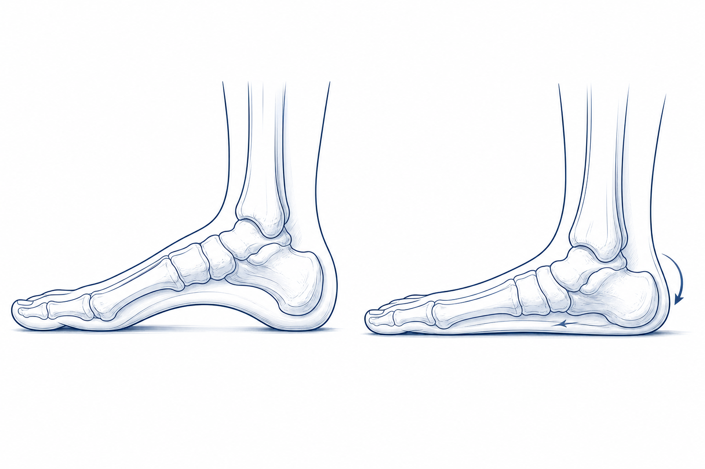
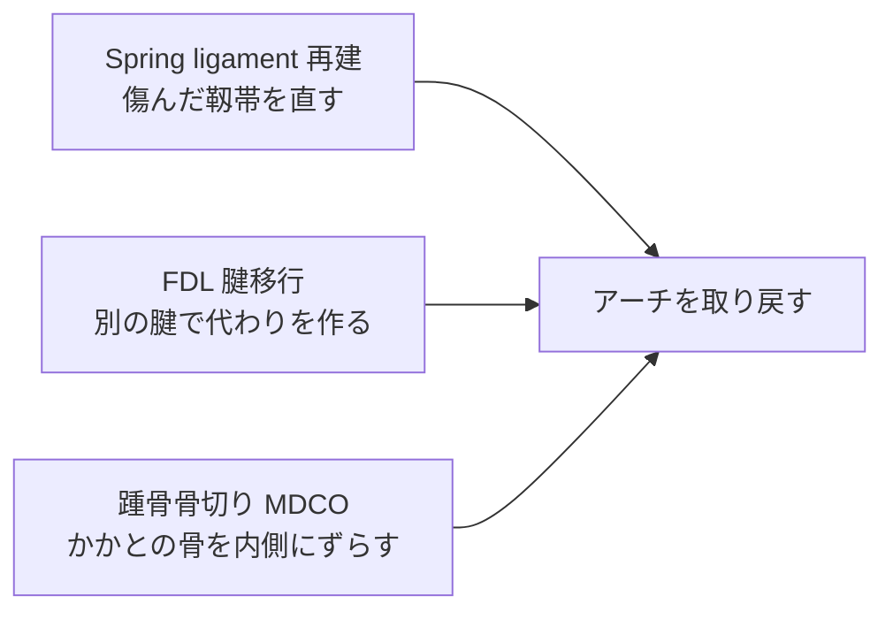
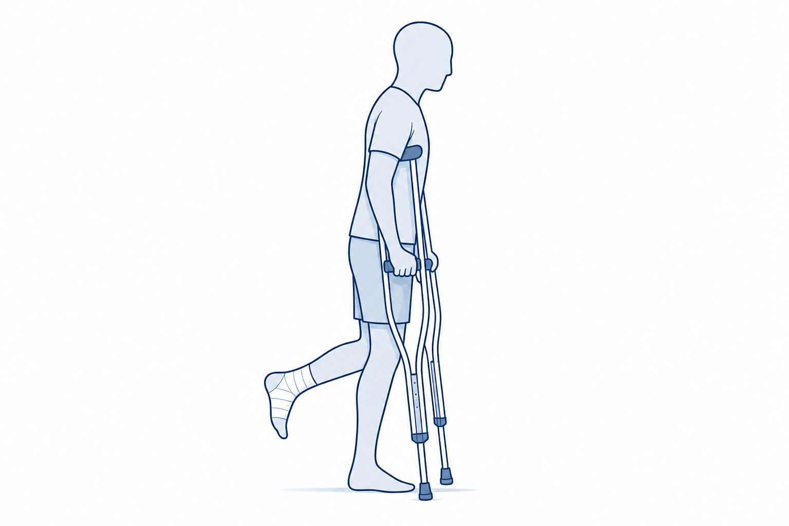

# 扁平足

「最近、土踏まずが落ちてきた気がする」「内くるぶしの内側が痛い」「長く歩くと足が疲れる」 — そんなお悩みはありませんか。
扁平足は決して珍しい病気ではなく、中年以降の女性に多くみられます。
このページでは、扁平足の2つのタイプと、それぞれの治療の選び方を、わかりやすくご説明します。

<figure class="figure-schema" markdown>

<figcaption>左：正常な足（土踏まずがある）　／　右：扁平足（土踏まずが落ちている）</figcaption>
</figure>

## 1. どんな病気？

足の内側にある「土踏まず」のアーチが落ちて、足の裏全体が地面についてしまう状態です。

### 主な原因

- 加齢とともに、**後脛骨筋腱（こうけいこつきんけん）** という腱の働きが弱くなることが、最大の原因です
- 女性、肥満、糖尿病、関節リウマチ、ステロイドの長期使用 がリスク
- 中高年以降、片足から徐々に進むことが多いです

### こんな症状ありませんか？

- 内くるぶしの **後ろが痛い、腫れる**
- 長く歩くと **内側が痛い**
- だんだん **足が外を向いて見える** ようになった
- 靴の **内側がすり減る**
- 進行すると **外側も痛く** なってくる

---

## 2. 扁平足には2つのタイプがあります

### 2-1. やわらかい扁平足（**Flexible：フレキシブル**）

- 立つとアーチが落ちますが、**手で押すとアーチが戻ります**
- つま先立ちはできる（あるいは、がんばればできる）
- **早期〜中期** の状態

### 2-2. 硬い扁平足（**Rigid：リジット**）

- アーチが完全に潰れていて、**手で押しても戻りません**
- つま先立ちが難しい・できない
- 関節が固まっている（**進行期**）
- 周りの関節も傷んできます

→ どちらのタイプかによって治療法が大きく変わるので、診察で **足を動かしたり、つま先立ちをしてもらったり** して確認します。

---

## 3. 検査でわかること

| 検査 | わかること |
|------|------|
| 問診・診察 | 痛みの場所、進行具合、つま先立ちチェック |
| **荷重位レントゲン**（立って撮る） | アーチの落ち具合、関節の傷み |
| MRI | **後脛骨筋腱** の状態、靱帯の状態 |
| CT（荷重位 CT） | 3次元で立体的に評価（進行例の手術計画） |

---

## 4. 治療

### 4-1. まずは保存治療

#### インソール・装具

- **アーチサポートインソール** が基本です
- 進行例では **足首装具（AFO）** を併用
- 後足部を補正するインソール

#### リハビリ

- **後脛骨筋（つま先を内側に動かす筋肉）の強化**
- アキレス腱のストレッチ
- 足の指の運動（足の中の小さい筋肉を鍛える）

#### 薬

- 痛み止め（飲み薬・湿布）
- ※ ステロイド注射は **腱を傷める恐れがあるので避けます**

### 4-2. 手術を考えるとき

- 半年〜1年の保存治療でも痛み・変形が進んでしまう
- お仕事や日常生活に支障が大きい
- 硬い扁平足になってきた

---

## 5. 手術：タイプで方法が変わります

### 5-1. やわらかい扁平足（Flexible）→ **靱帯を再建する手術**

主に組み合わせで行います。

- **傷んだ靱帯（Spring ligament）を縫って直し・補強**
- **別の腱（FDL: 長趾屈筋腱）を移植** して、弱った後脛骨筋腱の働きを補います
- **かかとの骨を切って内側にずらします**（MDCO）— 後足部の外反を直します
- 必要に応じて **外側の骨切り**（足の前を外向きから戻す）や **アキレス腱の延長** を併用

→ 自分の関節は残せます。動きも保てます。

### 5-2. 硬い扁平足（Rigid）→ **骨切り or 関節固定**

- **三関節固定**：傷んだ3つの関節（距骨下・距舟・踵立方）をくっつけて固定します
- **後足部の骨切り**：早期 Rigid で、関節を温存できそうな場合に選びます
- 末期で足首も傷んでいれば、足関節の手術（人工足関節 or 足首固定）と組み合わせて行います

→ 確実に痛みは取れますが、その関節は動かなくなります。

---

## 6. 手術後の生活（**Flexible・Rigid 共通**）

!!! info "後療法のポイント"
    - **最初の6週間は足を地面につけません**（松葉杖で生活）
    - 抜糸: **10〜14日**
    - **3か月はサポーターを着けます**
    - シャワー: **抜糸前は濡らさなければ可**、**抜糸後は許可**

### 6-1. スケジュール

```mermaid
gantt
    title 術後の目安スケジュール
    dateFormat  X
    axisFormat  %s

    section 荷重
    非荷重(松葉杖)        :a1, 0, 6
    部分荷重→全荷重      :a2, 6, 12
    フリー                :a3, 12, 26

    section 外固定
    シーネ                :b1, 0, 2
    ブーツ装具            :b2, 2, 6
    サポーター            :b3, 6, 13

    section 活動
    デスクワーク復帰      :c1, 6, 26
    立ち仕事復帰          :c2, 13, 26
    スポーツ復帰          :c3, 26, 50
```

| 時期 | 内容 |
|------|------|
| 0〜2週 | シーネ、**完全非荷重**、足を高く上げる |
| 2〜6週 | ブーツ装具、**非荷重継続**、抜糸 |
| **6週〜** | **部分荷重から全荷重へ**、サポーターに変わります |
| **3か月** | 全荷重、サポーター継続、デスクワーク復帰可、立ち仕事も検討 |
| 6か月〜 | スポーツ復帰（種目により段階的）、サポーターは長距離・スポーツ時 |

### 6-2. 6週間非荷重の準備（重要）

<figure class="figure-schema" markdown>

<figcaption>手術した足を完全に浮かせ、松葉杖2本で体重を支えて移動します。慣れるまで少し練習が必要です。</figcaption>
</figure>

非荷重の期間が長いので、**手術前に生活環境の準備** が大切です。

- 自宅内の手すり・段差の確認
- ベッド・トイレ・お風呂への動線
- ご家族の支援、介護サービスの相談
- お仕事の調整（在宅勤務、休職）
- 食事・買い物の手配

「6週間も足をつけないなんて大変…」と不安に感じるのは当然です。ぜひ事前に主治医・ソーシャルワーカーにご相談ください。

### 6-3. お風呂・シャワー

| 時期 | シャワー | お風呂 |
|------|---------|------|
| 抜糸まで（〜14日） | **濡らさなければOK**（防水カバー） | × |
| **抜糸後** | **許可** | **許可** |

---

## 7. こんなときは病院にご連絡ください

!!! danger "すぐ病院へ"
    以下の症状は、感染や血流障害のサインのことがあります。遠慮なくご連絡ください。

    - 急な強い痛み、薬が効かない
    - 足の指が **冷たい・しびれる・色が悪い**
    - 装具・サポーターの中が **きつくて痛い**
    - 傷から **膿・悪臭・赤みが広がる**
    - **38℃以上の発熱** が続く
    - ふくらはぎが **腫れて痛い**（血栓のサイン）
    - 急な **息切れ・胸の痛み**

---

## 8. よくいただくご質問

??? question "扁平足は、誰でも手術が必要ですか？"
    いいえ。多くの方は **保存治療** で症状が落ち着きます。手術は、痛みが強く、変形が進み、日常生活に大きく支障があるときの選択肢です。

??? question "6週間も足をつけないってつらくないですか？"
    確かに大変ですが、ここをしっかり守ることが、手術の成功につながります。事前に生活環境を整え、ご家族の協力を得て準備しましょう。在宅勤務やデスクワークなら、松葉杖で出勤可能な方もいらっしゃいます。

??? question "やわらかい扁平足から、硬い扁平足になるのを止められますか？"
    早期の装具治療と運動療法で **進行を遅らせる** ことはできますが、必ず止められるとは限りません。痛みや変形が進んでいる場合は、早めに手術を検討するほうが結果が良いことが多いです。

??? question "両足とも手術したいのですが？"
    通常は片足ずつです。6週間非荷重が必要なので、両足同時だと生活ができなくなってしまうためです。

??? question "後脛骨筋のトレーニングって、自分でもできますか？"
    はい。ゴムバンドを使って足を内側に動かすトレーニング、片足のかかと上げ などを、医師・理学療法士の指導のもと行います。「無理しすぎず、続ける」ことが大切です。

??? question "保険・費用は？"
    日本では保険診療です。**高額療養費制度** の対象です。詳しくは医療相談室へ。

---

## 関連ページ

- [医療従事者向け：扁平足](../clinical/flatfoot/index.md)
- [患者さん向けトップ](index.md)
