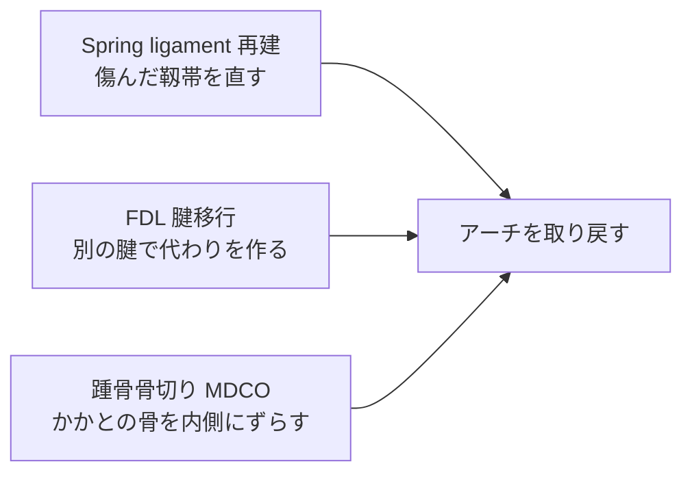

# 扁平足

!!! abstract "このページのまとめ"
    - 扁平足は **「アーチが落ちて、土踏まずがない足」** の状態です
    - 中年以降に進む扁平足は **後脛骨筋腱（こうけいこつきんけん）** という腱の働きが弱くなることが主な原因です
    - 扁平足には **「やわらかい扁平足（フレキシブル）」** と **「硬い扁平足（リジット）」** の2つがあります
    - **フレキシブル**：手で押せばアーチが戻る → **靱帯（じんたい）を再建する手術**
    - **リジット**：硬くて戻らない → **骨を切る手術や関節を固定する手術**
    - **どちらの手術も、6週間は足をつけない・3か月はサポーターを使う** のが基本です

---

## 1. どんな病気？

### 扁平足とは

足の内側にある「土踏まず」のアーチが落ちて、足の裏全体が地面についてしまう状態です。

### 主な原因

- 加齢で **後脛骨筋腱（こうけいこつきんけん）** が傷んでくる（最大の原因）
- 女性、肥満、糖尿病、関節リウマチ、長期のステロイド使用がリスク
- 中年以降、片足から徐々に進むことが多い

### よくある症状

- 内くるぶしの後ろが痛い、腫れる
- 長く歩くと内側が痛い
- だんだん足が外を向いて見える
- 靴の内側がすり減る
- 進行すると外側も痛くなる

---

## 2. 扁平足の2タイプ

### 2-1. やわらかい扁平足（**Flexible / フレキシブル**）

- 立つとアーチが落ちるが、**手で押すとアーチが戻る**
- つま先立ちはできる（あるいはがんばればできる）
- **早期〜中期** の状態

### 2-2. 硬い扁平足（**Rigid / リジット**）

- アーチが完全に潰れていて、**手で押しても戻らない**
- つま先立ちが難しい・できない
- 関節が固まっている（**進行期**）
- 周りの関節も傷んでくる

→ どちらのタイプか確かめるために、診察で **足を動かしたり、つま先立ちをしてもらったり** します。

---

## 3. 検査

| 検査 | 目的 |
|------|------|
| 問診・診察 | 痛みの場所、進行具合、つま先立ちチェック |
| **荷重位レントゲン**（立って撮る） | アーチの落ち具合、関節の傷み |
| MRI | **後脛骨筋腱**の状態、靱帯の状態 |
| CT（荷重位 CT） | 3次元評価、進行例の手術計画 |

---

## 4. 治療

### 4-1. まずは保存治療

#### インソール・装具

- **アーチサポートインソール**
- 進行例では **足首装具（AFO）**
- 後足部を補正するインソール

#### リハビリ

- **後脛骨筋（つま先を内側に動かす筋肉）の強化**
- アキレス腱のストレッチ
- 足の指の運動（足の中の小さい筋肉を鍛える）

#### 薬

- 痛み止め（飲み薬・湿布）
- ※ ステロイド注射は **腱を傷める恐れがあるので避ける**

### 4-2. 手術を考えるとき

- 半年〜1年の保存治療でも痛み・変形が進む
- 仕事や日常生活に支障が大きい
- 硬い扁平足になっている

---

## 5. 手術：タイプで方法が変わります

### 5-1. やわらかい扁平足（Flexible）→ **靱帯を再建する手術**

主に組み合わせで行います：

- **傷んだ靱帯（Spring ligament）を縫って直す・補強する**
- **別の腱（FDL: 長趾屈筋腱）を移植**して、弱った後脛骨筋腱の働きを補う
- **かかとの骨を切って内側にずらす**（MDCO）— 後足部の外反を直す
- 必要に応じてさらに **外側の骨切り**（足の前を外向きから戻す）や **アキレス腱の延長** を併用

→ 自分の関節は残せます。動きも保てます。

### 5-2. 硬い扁平足（Rigid）→ **骨切り or 関節固定**

- **三関節固定**：傷んだ3つの関節（距骨下・距舟・踵立方）をくっつけて固定
- **後足部の骨切り**：早期 Rigid で関節を温存できそうな場合に選択
- 末期で足首も傷んでいれば、足関節の手術（人工足関節 or 足首固定）と組み合わせ

→ 確実に痛みは取れますが、その関節は動かなくなります。

---

## 6. 手術後の生活（**Flexible・Rigid 共通**）

!!! info "後療法のポイント"
    - **最初の 6 週間は足を地面につけない**（松葉杖で生活）
    - 抜糸: **10〜14日**
    - **3 か月はサポーターを着ける**
    - シャワー: **濡らさなければ早期からOK**、**抜糸後はフリー**

### 6-1. スケジュール

```mermaid
gantt
    title 術後の目安スケジュール
    dateFormat  X
    axisFormat  %s

    section 荷重
    非荷重(松葉杖)        :a1, 0, 6
    部分荷重→全荷重      :a2, 6, 12
    フリー                :a3, 12, 26

    section 外固定
    シーネ                :b1, 0, 2
    ブーツ装具            :b2, 2, 6
    サポーター            :b3, 6, 13

    section 活動
    デスクワーク復帰      :c1, 6, 26
    立ち仕事復帰          :c2, 13, 26
    スポーツ復帰          :c3, 26, 50
```

| 時期 | 内容 |
|------|------|
| 0〜2 週 | シーネ、**完全非荷重**、足を高く上げる |
| 2〜6 週 | ブーツ装具、**非荷重継続**、抜糸 |
| **6 週〜** | **部分荷重から全荷重へ**、サポーターに変わる |
| **3 か月** | 全荷重、サポーター継続、デスクワーク復帰可、立ち仕事も検討 |
| 6 か月〜 | スポーツ復帰（種目により段階的）、サポーターは長距離・スポーツ時 |

### 6-2. 6週間非荷重の準備

非荷重期間が長いので、**手術前に生活環境の準備** が大切です。

- 自宅内の手すり・段差確認
- ベッド・トイレ・お風呂への動線
- 家族の支援、介護サービスの相談
- 仕事の調整（在宅勤務、休職）
- 食事・買い物の手配

### 6-3. お風呂・シャワー

| 時期 | シャワー | お風呂 |
|------|---------|------|
| 抜糸まで（〜14日） | **濡らさなければOK**（防水カバー） | × |
| **抜糸後** | **濡らしてOK・自由** | **OK・自由** |

---

## 7. こんなときは病院に連絡

!!! danger "すぐ病院へ"
    - 急な強い痛み、薬が効かない
    - 足の指が **冷たい・しびれる・色が悪い**
    - 装具・サポーターの中が **きつくて痛い**
    - 傷から **膿・悪臭・赤みが広がる**
    - **38℃以上の発熱** が続く
    - ふくらはぎが **腫れて痛い**（血栓のサイン）
    - 急な **息切れ・胸の痛み**

---

## 8. よくある質問

??? question "扁平足は誰でも手術が必要？"
    いいえ。多くの方は **保存治療** で症状が落ち着きます。手術は痛みが強く、変形が進み、日常生活に大きく支障がある方が対象です。

??? question "6週間も足をつけないってつらくないですか？"
    確かに大変ですが、ここをしっかり守ることが手術の成功につながります。事前に生活環境を整え、家族の協力を得て準備しましょう。在宅勤務やデスクワークなら松葉杖で出勤可能な方もいます。

??? question "やわらかい扁平足から硬い扁平足になるのを止められますか？"
    早期の装具治療と運動療法で **進行を遅らせる** ことはできますが、必ず止められるとは限りません。痛みや変形が進んでいるなら、早めに手術を検討する方が結果が良いことが多いです。

??? question "両足ともやりたいのですが？"
    通常は片足ずつです。6週間非荷重が必要なので、両足同時だと生活ができなくなります。

??? question "保険・費用は？"
    日本では保険診療です。高額療養費制度の対象です。詳しくは医療相談室へ。

---

## 関連ページ

- [医療従事者向け：扁平足](../clinical/flatfoot/index.md)
- [患者さん向けトップ](index.md)
