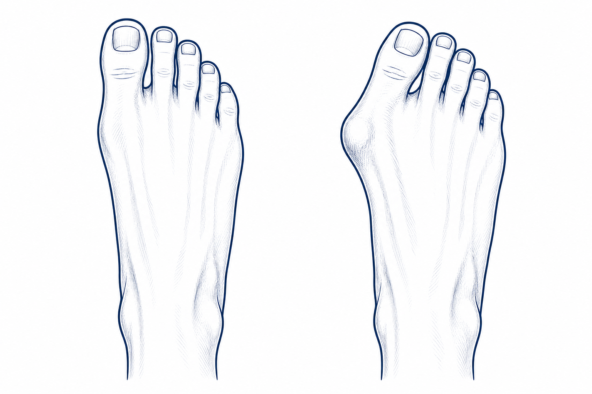
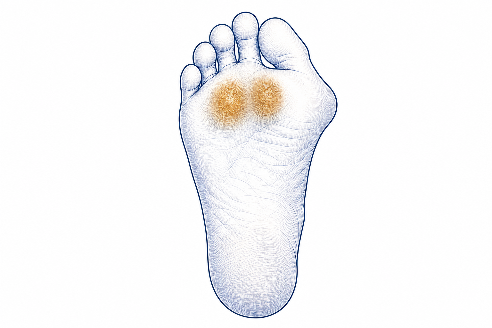
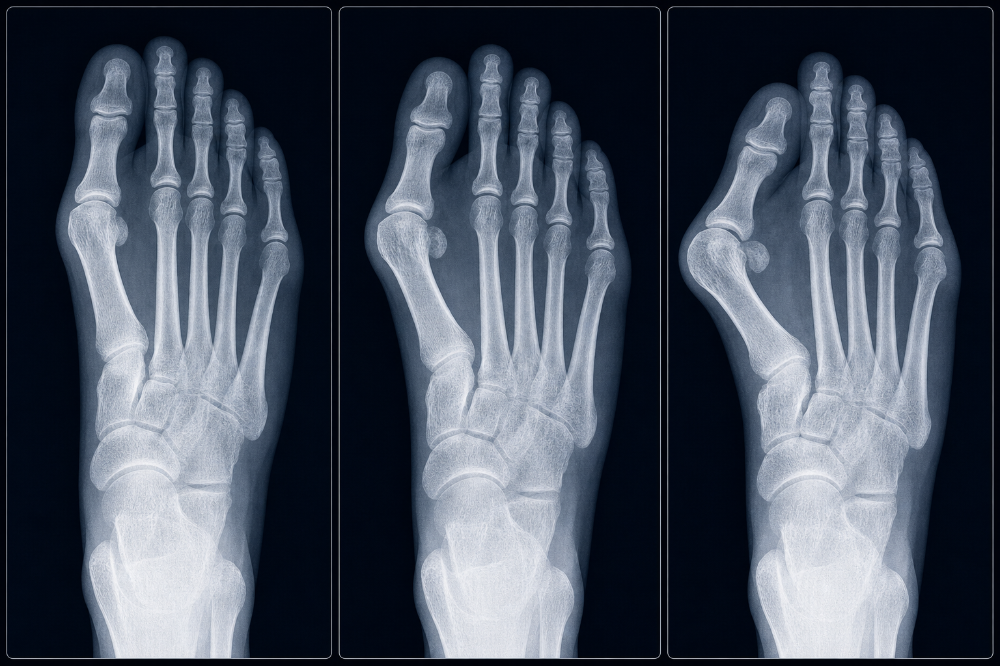
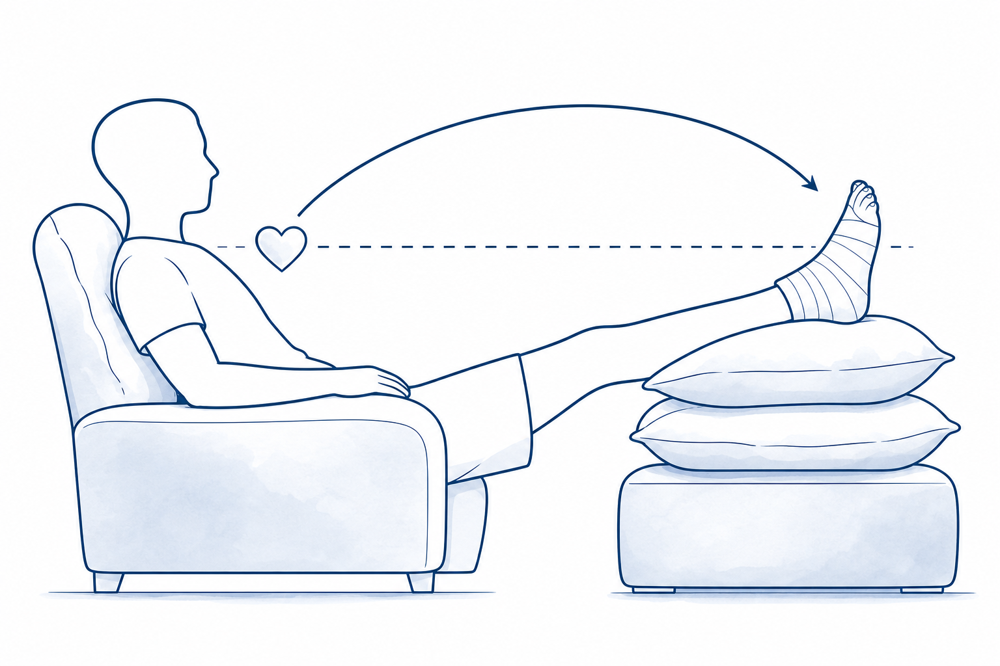
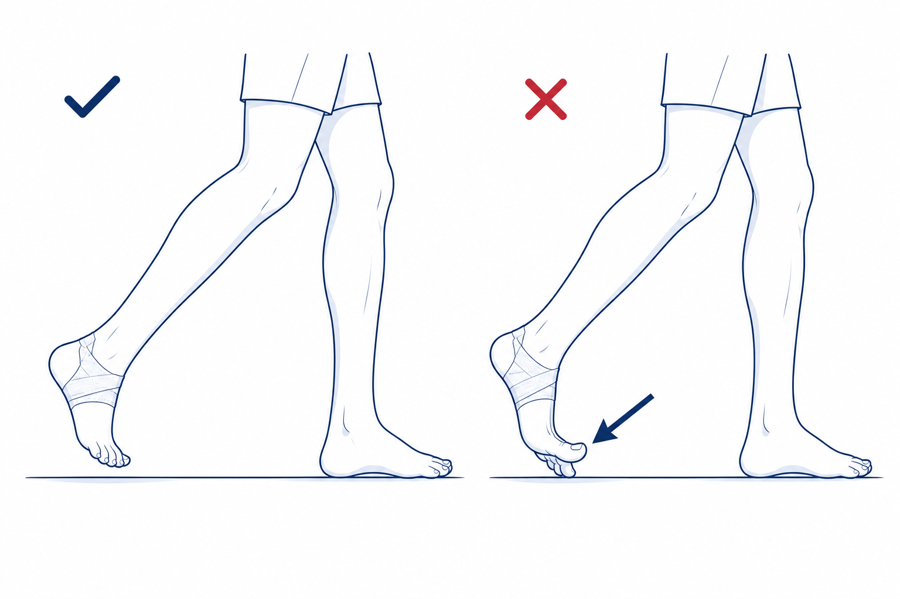
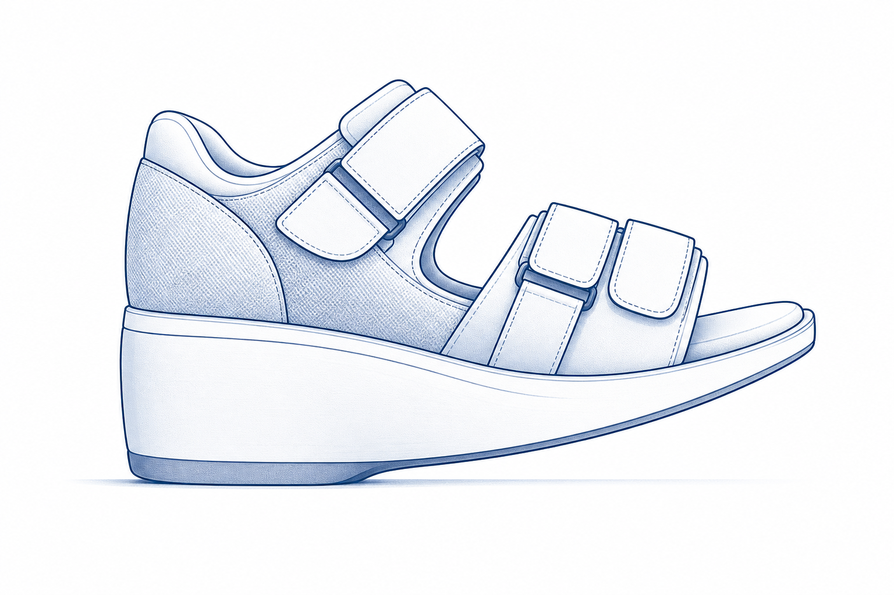

# 外反母趾

「親指の付け根が痛くて、靴選びに困っている」「外反母趾は手術しかないって言われた…でも、できれば避けたい」 — そんなお気持ちをお持ちではありませんか。
外反母趾は、**見た目の曲がりだけで手術を決める病気ではありません**。痛みで歩きにくい、靴が合わない、日常生活に支障があるときに、はじめて手術を選択肢として考えます。
このページでは、外反母趾とのつきあい方を、患者さんの目線でご説明します。

<figure class="figure-schema" markdown>

<figcaption>左：正常な右足　／　右：外反母趾の右足 — 親指が外側に曲がり、付け根の内側が出っ張っているのが分かります。</figcaption>
</figure>

## 1. どんな病気？

足の親指（母趾）の付け根が **「く」の字** に曲がって、内側の骨が飛び出してくる状態です。
靴を履くと当たって痛い、足の形が気になる、長く歩くと疲れる — そんな症状が出ます。

### 「親指の隣の指の付け根」が痛くなるのが特徴

外反母趾が進むと、**親指の隣（第2・3趾の付け根）** に体重がかかるようになり、足の裏の付け根あたりが痛くなります。

1. 親指の付け根の **内側が突き出してくる**（バニオン）→ 靴に当たって痛い
2. 親指がうまく蹴り出せなくなる
3. **隣の指（第2・3趾）の付け根に体重がかかる**
4. **足の裏の付け根（中足骨頭）が痛くなる**
5. たこ（胼胝）ができたり、第2趾が「く」の字に曲がってくる

<figure class="figure-schema" markdown>

<figcaption>外反母趾が進むと、親指で蹴り出せなくなり、**第2・3趾の付け根（中足骨頭）の真下にタコ（胼胝）** ができてきます。これが「足の裏が痛い」原因の一つです。</figcaption>
</figure>

→ この **「親指の隣の付け根の痛み」が手術を考える大事なサイン** です。

## 2. 原因

- 女性に多い病気です（ホルモン、関節のやわらかさが関係）
- ご家族に外反母趾の方がいる（遺伝の要素あり）
- **先の細い靴・ハイヒール** を長く使った経歴
- 偏平足、関節リウマチ など

## 3. 重症度（角度で評価）

<figure class="figure-schema" markdown>

<figcaption>左から **軽度・中等度・重度** の外反母趾。同じ右足のレントゲンで、親指の曲がりと付け根の出っ張りが進行していく様子を示しています。</figcaption>
</figure>

| | 軽度 | 中等度 | 重度 |
|---|:---:|:---:|:---:|
| **外反母趾角** | 15〜25度 | 25〜40度 | 40度以上 |
| **見た目** | 少し曲がってきた | はっきり「く」の字 | 親指が第2趾に乗る／押す |

ただし、**角度だけで治療を決めるわけではありません**。痛みや日常生活への支障を、ご一緒に考えながら治療方針を決めていきます。

---

## 4. 治療

### 4-1. まずは保存治療

**インソール（足底板）が基本** です。

- **インソール** — 第2・3趾の付け根への負担を減らすパッドを入れます
- **靴の見直し** — 先の広い、ヒールの低い靴を
- **足の指の運動** — タオルギャザー、足指じゃんけん
- 痛み止め（飲み薬・湿布）

!!! tip "インソールは「続ける」のが大事"
    インソールは **続けて使い続けないと効果が薄れます**。「痛みが減ったからやめる → また痛くなる → 通院」を繰り返さないように、ぜひ習慣にしてみてください。

### 4-2. 手術を検討するとき

外反母趾は、見た目の曲がりだけで手術を決める病気ではありません。次のようなときに、手術を **選択肢のひとつ** としてご相談します。

- **第2・3趾の付け根の痛み** が強く、歩くのがつらい
- 靴の選択肢が大きく狭まり、生活に支障が出ている
- 6か月以上、保存治療を続けても痛みが取れない

「整形外科の手術」と聞くと身構えてしまうかもしれませんが、当院では **傷跡が小さく、負担の少ない手術（MICA法）** を行っています。

---

## 5. 当院の手術：MICA + 必要に応じて DMMO

### 5-1. MICA（マイカ）とは

- **Minimally Invasive Chevron-Akin** の略
- **2〜3mmの小さな傷を数か所** だけ作る、低侵襲の手術
- 専用の **低速回転バー** で骨を切ります（熱で骨が傷まないよう、ゆっくり回します）
- 切った骨を **スクリュー2本** で固定します
- レントゲン透視を見ながら、正確に進めます

### 5-2. DMMO（ディーエムエムオー）— 必要に応じて同時に

- **Distal Metatarsal Minimally invasive Osteotomy** の略
- 第2・3趾の付け根が痛い方には、**第2・3の中足骨の首の部分を小さく骨切り** します
- **固定はしません**。歩いているうちに自然に整います
- MICA と **同じ手術中** に一緒に行います

### 5-3. 手術の流れ

- 麻酔: 腰椎麻酔 + 神経ブロック または 全身麻酔
- 手術時間: 30〜60分程度（DMMO併施で +20分程度）
- 入院期間: 1〜数日（病院により異なります）

---

## 6. 手術後の生活（とても大事）

### 6-1. 術後すぐ：弾性包帯で圧迫しています

- 創部は **弾性包帯とガーゼでしっかり圧迫** しています
- **ご自身では外さないでください**（矯正位がずれてしまいます）
- 次の外来（10〜14日後の抜糸）まで、包帯はそのままです

### 6-2. 最初の2週間：**挙上（足を高く上げる）がいちばん大切です**

<figure class="figure-schema" markdown>

<figcaption>術後 2 週間は、椅子・ソファでくつろぐときも、足を **心臓より高く** 上げてください。クッションや枕を重ねて高さを出すのがコツです。</figcaption>
</figure>

!!! warning "最初の2週間の最優先事項"
    術後2週間は **腫れがピーク** になる時期です。この期間の **挙上の徹底** が、その後の経過を大きく左右します。

- **心臓より高く** 足を上げて過ごす（クッション・オットマン・枕などを活用）
- **座っているとき、寝ているときも常に挙上**
- 立ち上がる・歩く時間はできるだけ短くする
- トイレや食事など、必要な移動以外は挙上の姿勢を保つ

挙上が足りないと、腫れが長引き、痛み・しびれ・創部トラブルの原因になります。

### 6-3. 歩き方：**足の裏全体で着地、つま先で蹴り出さない**

<figure class="figure-schema" markdown>

<figcaption>左：歩幅を小さくして、**後ろ足が前足を追い越さない** ように歩く（OK）　／　右：通常の歩き方では後ろ足の **親指の付け根（MTP）が反って蹴り出す**「**踏み返し**」が起きてしまいます（NG・矢印部分） — 矯正した骨に負担をかけないため、最初の 6 週間は踏み返しを避けてください。</figcaption>
</figure>

!!! warning "歩き方ルール"
    - **足の裏全体で接地** します
    - **つま先で蹴り出さない**（踏み返し禁止）
    - 歩幅は小さく、ゆっくり

矯正した骨に余分な負担をかけないための、大切なルールです。

### 6-4. 履物のスケジュール

```mermaid
gantt
    title 履物のスケジュール
    dateFormat  X
    axisFormat  %s

    section 履物
    専用サンダル(前足部ヒール靴) :a1, 0, 6
    スニーカー                  :a2, 6, 12
    普通の靴                    :a3, 12, 26
```

<figure class="figure-schema" markdown>

<figcaption>術後6週間使用する「専用サンダル（前足部ヒール靴）」。かかとが厚く、つま先側は浮いているため、前足部に体重がかかりません。</figcaption>
</figure>

| 時期 | 履物 |
|------|------|
| 0〜6週 | **専用サンダル（前足部ヒール靴：かかとだけ厚く、つま先が浮く）** |
| 6週以降 | **スニーカー**（柔らかく幅広いもの） |
| 3か月以降 | 通常の靴（ハイヒールは控えていただきます） |

### 6-5. リハビリ：**「踏み返さないで歩ける」ことを目標に**

!!! tip "リハビリの最大の目標"
    術後リハビリの中心は **「踏み返しなしで、足の裏全体で歩けるようになる」** ことです。
    親指で蹴り出す動作（踏み返し）は、矯正した骨に余分な負担をかけてしまうため、最初の数週間は **やってはいけない動き** です。

#### 足の指の運動は積極的にOK

- **足の指は痛みのない範囲でアクティブに動かして大丈夫** です（拘縮予防のため、むしろ推奨）
- ただし **踏み返し（つま先で地面を蹴る動作）は禁止**
- 寝ているとき・座っているときに、自分で足の指をグー・パーする運動はどんどんやってください

| 運動 | 量 |
|------|---|
| 親指の付け根を曲げ伸ばし（自動） | 10〜15回 × 1日5〜10セット |
| 親指の付け根を手で動かす（他動） | 10回 × 1日3〜5セット |
| 足全体の指の運動（グー・パー） | 随時 |
| 足首を回す | 各方向10回 × 3セット |

→ **動かしていいのは「指」、ダメなのは「踏み返し（蹴り出し）」** と覚えてください。

### 6-6. シャワー・お風呂

| 時期 | シャワー | お風呂 |
|------|---------|------|
| 抜糸まで（術後 2 週間） | **創部を濡らさないように**（ビニール袋・防水カバー使用） | × |
| **抜糸後（2 週間〜）** | **許可** | **許可** |

- 抜糸前にうっかり濡らしてしまうと、感染のリスクが上がります
- 防水カバーや大きめのビニール袋をテープで密閉し、シャワーを浴びてください
- 抜糸後は、創部に石鹸をつけて優しく洗っても大丈夫です

### 6-7. 抜糸

- **術後10〜14日** に外来で抜糸
- 創部とレントゲンを確認、包帯を交換します
- 以降の通院は4〜6週後、3か月後、6か月後、1年後

---

## 7. こんなときは病院にご連絡ください

!!! danger "すぐ病院へ"
    以下の症状は、感染や血流障害のサインのことがあります。遠慮なくご連絡ください。

    - 痛みが急に強くなる、薬が効かない
    - 足の指が **冷たい・しびれる・色が悪い**
    - 包帯の中が **きつくて痛い**、足の指が腫れて変色
    - 傷から **膿・悪臭・赤みが広がる**
    - **38℃以上の発熱** が続く
    - ふくらはぎが **腫れて痛い**（血栓のサイン）
    - 急な **息切れ・胸の痛み**

---

## 8. 仕事・スポーツへの復帰

| 仕事・活動 | 復帰の目安 |
|----------|----------|
| デスクワーク | 2〜4週（サンダル可で出勤） |
| 立ち仕事 | 6〜8週（スニーカーに変わってから） |
| 重労働 | 3か月〜 |
| 運転（右足術） | 6〜8週（サンダルを脱げる時期から） |
| 軽いスポーツ | 3か月〜 |
| ランニング | 6か月〜 |
| ハイヒール | できれば再開しないことをおすすめします（再発予防のため） |

---

## 9. よくいただくご質問

??? question "両足同時に手術できますか？"
    通常は片足ずつ行います。両足とも前足部ヒール靴になると歩行が大きく制限されるためです。

??? question "歩けるようになるまで、どれくらいかかりますか？"
    手術翌日から専用サンダルで歩けます。普通のスニーカーに変わるのは **6週間後** からです。

??? question "傷あとは目立ちますか？"
    MICA は 2〜3mmの傷が数か所のみで、数か月で目立ちにくくなります。「お見合いに不利になるのでは…」と心配される方もいらっしゃいますが、多くの場合、半年もすればほとんどわかりません。

??? question "もう一度ハイヒールを履けますか？"
    術式選択が適切で、術後の靴・インソールを続けていれば再発リスクは低いですが、 **ハイヒールを再開するとまた進行する** ことがあります。お祝いの席など、短時間ご使用いただくのは大丈夫ですが、毎日のご使用はおすすめしません。

??? question "なぜ翌日から指を動かすのですか？痛そう…"
    親指の付け根の関節は **動かさないと固まりやすい** からです。固まると、あとで動きが悪くなってしまいます。痛くても少しずつ動かすほうが、長期的に楽になります。痛み止めを上手に使いながら、無理のない範囲で動かしてみてください。

??? question "保険・費用は？"
    保険診療の対象です。**高額療養費制度** を使えば月の自己負担が軽減されます。詳しくは病院の医療相談室にご相談ください。

??? question "親指の隣の指の痛みも、本当に取れますか？"
    DMMO を併施した方の多くで、第2・3趾の付け根の痛みが軽くなります。ただし、効果には個人差があり、術後にインソールを継続することで持続効果が高まります。

---

## 関連ページ

- [医療従事者向け：外反母趾（病態・治療）](../clinical/hallux-valgus/index.md)
- [患者さん向けトップ](index.md)
