# 外反母趾

!!! abstract "このページのまとめ"
    - 外反母趾は足の親指の付け根が「く」の字に変形する病気
    - **進んでくると親指の隣（第2・3趾の付け根）に痛みが出る**ことが多く、これが手術の判断材料になります
    - **曲がっているだけ（見た目だけ）では手術はしません**。**痛みで困っているときに手術** を検討
    - 当院では **MICA（小さい傷の手術）** を中心に行います。第2・3趾の付け根の痛みがあれば **DMMO** という小さな骨切りも一緒に行います
    - 術後は **専用のサンダルで6週間 → スニーカー**。**翌日から指を動かす** のがとても大事

---

## 1. どんな病気？

足の親指（母趾）の付け根が **「く」の字** に曲がって、内側の骨が飛び出す変形です。
歩くと痛い、靴が履きにくい、見た目が気になる、などの症状があります。

### よくある進行パターン

1. 親指の付け根の **内側が突き出してくる**（バニオン）→ 靴に当たって痛い
2. 親指の機能が落ちて、**隣の指（第2・3趾）の付け根に体重がかかる**
3. **第2・3趾の付け根（足の裏）が痛くなる**（中足骨頭痛）
4. たこ（胼胝）ができる、第2趾が「く」の字に曲がる（ハンマー趾）

→ この **「親指の隣の付け根の痛み」が手術を考える大事なサイン** です。

## 2. 原因

- 女性に多い（ホルモン、関節のやわらかさ）
- 家族歴
- **先の細い靴・ハイヒール** の長期使用
- 偏平足、関節リウマチ など

## 3. 重症度（角度で評価）

| 程度 | 外反母趾角 |
|------|------|
| 軽度 | 15〜25度 |
| 中等度 | 25〜40度 |
| 重度 | 40度以上 |

ただし、**角度だけで治療を決めません**。痛みや日常生活の支障を最重視します。

---

## 4. 治療

### 4-1. まずは保存治療（手術しない治療）

**インソール（足底板）が基本** です。

- **インソール** — 第2・3趾の付け根への負担を減らすパッドを入れる
- **靴の見直し** — 先の広い、ヒールの低いもの
- **足の指の運動** — タオルギャザー、足指じゃんけん
- 痛み止め（飲み薬・湿布）

!!! tip "保存治療のコツ"
    インソールは **継続して使い続けないと効果がありません**。
    痛みが減ったからやめる → 痛みが戻る、を繰り返さないように。

### 4-2. 手術を考えるとき

!!! warning "手術はこんな方に"
    - **見た目が気になるだけ・曲がっているだけ** → 手術しません
    - **痛みで日常生活に支障**（特に **第2・3趾の付け根の痛み**） → 手術を検討
    - 保存治療を6か月以上続けても痛みが取れない

---

## 5. 当院の手術：MICA + DMMO

### 5-1. MICA（マイカ）とは

- **Minimally Invasive Chevron-Akin** の略
- **2〜3mmの小さな傷を数カ所** だけ作る、低侵襲の手術
- 専用の **低速回転バー** で骨を切る（熱で骨が傷まないよう、ゆっくり回します）
- 切った骨を **スクリュー2本** で固定する
- レントゲン透視を見ながら正確に行う

### 5-2. DMMO（ディーエムエムオー）— 必要に応じて同時に

- **Distal Metatarsal Minimally invasive Osteotomy** の略
- 第2・3趾の付け根が痛い方に対して、**第2・3の中足骨の首の部分を小さく骨切り**します
- **固定はしません**。歩いているうちに自然に整います
- 親指のMICAと **一緒に同じ手術中** に行います

### 5-3. 手術の流れ

- 麻酔: 腰椎麻酔 + 神経ブロック または 全身麻酔
- 手術時間: 30〜60分程度（DMMO併施で +20分程度）
- 入院期間: 1〜数日（施設により）

---

## 6. 手術後の生活（とても大事）

### 6-1. 術後すぐ：弾性包帯で圧迫

- 創部は **弾性包帯とガーゼでしっかり圧迫** されています
- **自分では絶対に外さないでください**（矯正位が崩れます）
- 次の外来（10〜14日後の抜糸）まで包帯はそのまま

### 6-2. 最初の2週間：足を高く上げる

- **腫れが強く出ます**（術後2週間がピーク）
- **心臓より高く** 足を上げて過ごす
- 座っているときも足を上げる（オットマンなど）
- 夜は枕で足を高くして寝る

### 6-3. 歩き方：**足の裏全体で着地、踏み返し禁止**

!!! danger "歩き方ルール"
    - **足の裏全体で接地** する
    - **つま先で蹴り出さない**（踏み返し禁止）
    - 歩幅は小さく、ゆっくり

### 6-4. 履物のスケジュール

```mermaid
gantt
    title 履物のスケジュール
    dateFormat  X
    axisFormat  %s

    section 履物
    専用サンダル(前足部ヒール靴) :a1, 0, 6
    スニーカー                  :a2, 6, 12
    普通の靴                    :a3, 12, 26
```

| 時期 | 履物 |
|------|------|
| 0〜6週 | **専用サンダル（前足部ヒール靴：かかとだけ厚く、つま先が浮く）** |
| 6週以降 | **スニーカー**（柔らかく幅広いもの） |
| 3か月以降 | 通常の靴（ハイヒールは×） |

### 6-5. 指の運動：**翌日から積極的に**

!!! warning "拘縮（関節が固まる）予防がとても大事"
    親指の関節は **動かさないと固まりやすい** です。
    手術翌日から、痛みのない範囲で **親指を曲げ伸ばし** してください。
    包帯の中でも、意識して動かすことが大切です。

| 運動 | 量 |
|------|---|
| 親指の付け根を曲げ伸ばし（自動） | 10〜15回 × 1日 5〜10セット |
| 親指の付け根を手で動かす（他動） | 10回 × 1日 3〜5セット |
| 足全体の指の運動 | 随時 |
| 足首を回す | 各方向 10回 × 3セット |

### 6-6. シャワー・お風呂

| 時期 | シャワー | 入浴 |
|------|---------|------|
| 抜糸まで（10〜14日） | **濡らさない**（ビニール袋・防水カバー）でOK | × |
| 抜糸後・創部乾燥後 | **濡らしてOK** | OK |

### 6-7. 抜糸

- **術後10〜14日** に外来で抜糸
- 創部とX線を確認、包帯交換
- 以降の通院は4〜6週後、3か月後、6か月後、1年後

---

## 7. こんなときは病院に連絡

!!! danger "すぐ病院へ"
    - 痛みが急に強くなり、薬が効かない
    - 足の指が **冷たい・しびれる・色が悪い**
    - 包帯の中が **きつくて痛い**、足の指が腫れて変色
    - 傷から **膿・悪臭・赤みが広がる**
    - **38℃以上の発熱** が続く
    - ふくらはぎが **腫れて痛い**（血栓のサイン）
    - 急な **息切れ・胸の痛み**

---

## 8. 仕事・スポーツへの復帰

| 仕事・活動 | 復帰の目安 |
|----------|----------|
| デスクワーク | 2〜4週（サンダル可で出勤） |
| 立ち仕事 | 6〜8週（スニーカーに変わってから） |
| 重労働 | 3か月〜 |
| 運転（右足術） | 6〜8週（サンダルを脱いだ時期から） |
| 軽いスポーツ | 3か月〜 |
| ランニング | 6か月〜 |
| ハイヒール | 推奨しません（再発予防） |

---

## 9. よくある質問

??? question "両足同時に手術できますか？"
    通常は片足ずつです。両足で前足部ヒール靴になると歩行困難になるためです。

??? question "歩けるようになるまでどれくらい？"
    手術翌日から専用サンダルで歩けます。普通のスニーカーは **6週間後** からです。

??? question "傷あとは目立ちますか？"
    MICA は 2〜3mmの傷が数カ所のみで、数か月で目立ちにくくなります。

??? question "再発しますか？"
    術式選択が適切で、術後の靴・インソールを継続すれば再発リスクは低いですが、ハイヒール再開で進行することがあります。

??? question "保険・費用は？"
    保険診療の対象です。高額療養費制度を使えば月の自己負担が軽減されます。病院の医療相談室にご相談ください。

??? question "なぜ翌日から指を動かすの？"
    親指の付け根の関節は **動かさないと固まりやすい**（拘縮）からです。固まってしまうと後で動きが悪くなるので、痛くても少しずつ動かすことがとても大事です。

---

## 関連ページ

- [医療従事者向け：外反母趾（病態・治療）](../clinical/hallux-valgus/index.md)
- [患者さん向けトップ](index.md)
