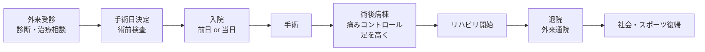

# 患者さん・ご家族の方へ

足の痛みや手術に対する不安を、少しでも和らげていただけるように、病気のしくみと治療の流れをまとめました。
ご家族の方と一緒にご覧いただいて構いません。
わからない言葉が出てきたら、遠慮なく主治医や看護師さんに聞いてくださいね。

## 症状から探す

「自分はどの病気だろう？」と迷われた方は、近い症状の項目を選んでみてください。

- **足首をひねった／繰り返し捻挫する／足首がぐらつく**

    ---
    若い頃のスポーツの捻挫が残っている方、年齢とともに足首が不安定になってきた方へ。

    → [足関節不安定症・足首の捻挫](ankle-instability.md)

- **親指の付け根が痛い／靴に当たって痛い／足の付け根が「く」の字になってきた**

    ---
    親指の隣（第2・3趾の付け根）まで痛い方も多くいらっしゃいます。

    → [外反母趾](hallux-valgus.md)

- **歩き始めに足首が痛い／長く歩くとつらい／昔の骨折のあと痛みが残る**

    ---
    足首の軟骨がすり減ってきている可能性があります。

    → [変形性足関節症](ankle-osteoarthritis.md)

- **土踏まずが落ちてきた／内くるぶしの内側が痛い／長く歩くと足が疲れる**

    ---
    後脛骨筋腱の機能が落ちている可能性があります。

    → [扁平足](flatfoot.md)

---

## 入院・手術の大まかな流れ

---

## 診察室で聞いておきたい質問メモ

外来は時間が限られていて、聞きたいことを忘れてしまいがちです。
気になることをメモして、診察のときに主治医にご相談ください。

??? question "手術の名前は何ですか？"
    術式の名前と、おおまかな内容（骨を切るのか、靱帯を縫うのか など）を確認しておくと、ご家族に説明するときも安心です。

??? question "麻酔はどんな種類ですか？"
    全身麻酔か、腰椎麻酔か、神経ブロックを併用するかを確認。アレルギーや、過去の麻酔で気分が悪くなった経験があればこのときに伝えましょう。

??? question "入院期間はどのくらいですか？"
    日帰り〜1週間まで疾患・術式で幅があります。仕事・家族の予定を立てるために事前に確認を。

??? question "いつから足をついていいですか？／いつから歩けますか？"
    疾患によっては **6週間足をつけない** こともあります。自宅環境（手すり、トイレ、お風呂）の準備が必要です。

??? question "いつから仕事に戻れますか？"
    デスクワーク・立ち仕事・重労働で復帰時期が大きく違います。職場の調整に必要なので、目安を確認しましょう。

??? question "退院後のリハビリはどこで、どのくらいの頻度ですか？"
    通所リハ・訪問リハ・自宅トレーニングの組み合わせを確認。

??? question "今飲んでいる薬は続けていいですか？"
    特に **血をサラサラにする薬（抗血栓薬）、ステロイド、関節リウマチの薬** は事前確認が必須です。お薬手帳を持参してください。

??? question "アレルギーはどう伝えればいいですか？"
    薬・テープ・金属・ヨード（消毒）・ラテックスのアレルギーがあれば、初診時から伝えておくと安心です。

??? question "シャワー・お風呂はいつから入れますか？"
    抜糸前は防水カバーが必要なことが多く、抜糸後は許可になるケースが多いです。

??? question "費用はどのくらいかかりますか？"
    日本国内は保険診療で、高額療養費制度の対象です。詳しくは病院の **医療相談室・ソーシャルワーカー** にご相談ください。

---

## 入院・手術の前に準備しておくと安心なこと

- 履きやすい靴（術後しばらくは前足部ヒール靴や装具を使うことがあります）
- 松葉杖が使える生活環境（家の中の動線、手すり）
- ご家族の協力体制（特に最初の2週間〜6週間）
- 仕事・学校・スポーツの予定調整
- お薬手帳・健康保険証・限度額適用認定証

---

!!! warning "緊急のときは、ためらわずご連絡ください"
    手術後、以下のような **急な症状** があれば、夜間・休日であってもご連絡ください。
    これらは感染や血流障害など、早く対処すべきサインのことがあります。

    - 急に足が痛くなる、薬が効かない
    - 足の指が冷たくなる、色が悪くなる、しびれる
    - 包帯・シーネ（ギプス）の中がきつい
    - 傷から膿が出る、強い赤みが広がる
    - 38℃以上の発熱
    - ふくらはぎが腫れて痛い
    - 急な息切れ・胸の痛み

    「これくらいで連絡していいのかな」と迷ったら、迷わず連絡してください。
