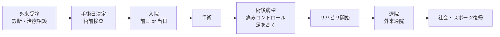

# 患者さん向け

このページは、足の手術を受ける患者さん・ご家族向けに、病気と治療を **やさしい言葉** で解説するページです。

!!! info "ご利用にあたって"
    - 一般的な情報ですので、ご自身の治療方針は **必ず主治医に確認** してください。
    - わからない言葉は遠慮なく主治医や看護師に聞いてください。

---

## 疾患から探す

- :material-rotate-3d-variant: **足関節不安定症（足首がぐらぐらする）**

    ---
    捻挫を繰り返して足首が不安定になる病気。手術と術後の生活について。

    [ページを見る →](ankle-instability.md)

- :material-bandage: **外側側副靱帯損傷（足首の捻挫）**

    ---
    足首をひねったときに切れる靱帯のけが。治し方の選択肢。

    [ページを見る →](lateral-ligament-injury.md)

- :material-foot-print: **外反母趾**

    ---
    足の親指が小指側に曲がる変形。靴と手術の話。

    [ページを見る →](hallux-valgus.md)

- :material-bone: **変形性足関節症**

    ---
    年齢や過去のけがで足首の軟骨がすり減る病気。手術の種類。

    [ページを見る →](ankle-osteoarthritis.md)

---

## 入院・手術の流れ（共通）

## 主治医に確認しておくこと

- 手術の名前
- 麻酔の種類（全身麻酔・腰椎麻酔・神経ブロック）
- 入院期間の目安
- いつから歩けるか、いつから仕事復帰できるか
- 退院後のリハビリ通院頻度
- 飲んでいる薬の継続・中止
- アレルギー（薬・テープ・金属）

---

!!! warning "緊急時の連絡"
    手術後、以下のような **急な症状** があれば、ためらわず病院に連絡してください。

    - 急に足が痛くなる、薬が効かない
    - 足の指が冷たくなる、色が悪くなる、しびれる
    - シーネ（ギプス）の中がきつい
    - 傷から膿が出る、強い赤みが広がる
    - 38℃以上の発熱
    - ふくらはぎが腫れて痛い
    - 急な息切れ・胸の痛み
